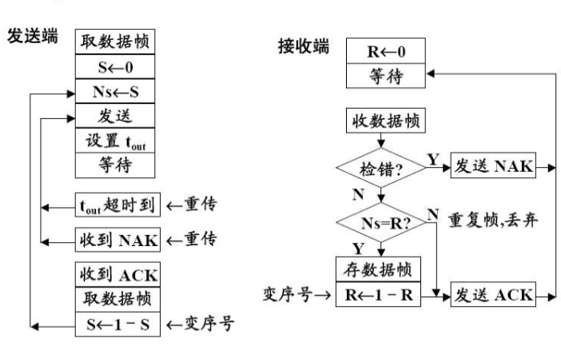

# 3.4.3 可靠的停-等协议 (有差错信道)

这是对停-等协议的完善，使其能够在一个**不可靠（有差错、会丢帧）**的信道上工作。这是数据链路层最基础、也是最重要的可靠传输协议之一。

### 核心概念

#### 1. 新的挑战：信道不可靠

现实中的信道会带来以下几种问题：

1.  **数据帧出错**: 帧在传输过程中发生比特错误。
2.  **数据帧丢失**: 帧在传输过程中丢失了。
3.  **确认帧 (ACK) 丢失**: 接收方发回的 ACK 在路上丢失了。
4.  **确认帧 (ACK) 迟到**: ACK 在路上延迟过长，以至于发送方以为它丢失了。

#### 2. 解决方案：引入差错控制机制

为了应对上述问题，我们在简单的停-等协议基础上增加以下机制：

##### a. 差错检测与确认机制 (针对数据帧出错)

*   **差错检测**: 接收方使用 CRC 等方法检查收到的帧是否有错。

*   **确认机制**:
    *   如果帧**无错**，接收方发送一个**肯定确认 (ACK)**。
    *   如果帧**有错**，接收方可以：
        *   **方案 1**: 发送一个**否定确认 (NAK 或 NACK)**，明确告知发送方该帧已损坏。发送方收到 NAK 后立即重传。
        *   **方案 2**: 直接**丢弃**错误帧，不作任何响应（**更常见的做法**）。

##### b. 超时重传机制 (针对数据帧/ACK 丢失)

*   **问题**: 如果数据帧丢失，或 ACK 丢失，发送方将永远等待下去，导致**死锁**。

*   **解决方案**:
    1.  发送方在每次发送一个数据帧时，启动一个**超时计时器 (Timeout Timer)**。
    2.  如果在计时器超时之前收到了 ACK，则一切正常，取消计时器。
    3.  如果在计时器超时后**仍未收到 ACK**，发送方就假定之前发送的帧或其 ACK 已经丢失。
    4.  发送方**自动重传**该数据帧，并重新启动计时器。

*   **超时时间设置**:
    *   超时时间 $T_{out}$ 的设置很关键。
    *   必须略大于一个正常的**往返时延 (RTT - Round-Trip Time)**。
    *   $T_{out} > RTT = 2 \times T_d + T_{proc}$
    *   其中 $T_d$ 是单程传播时延，$T_{proc}$ 是处理时延。

##### c. 帧编号机制 (针对重复帧)

*   **问题**: 超时重传可能导致**重复帧**的产生。
    *   例如：ACK 迟到了，发送方超时重传，接收方就会收到两个一模一样的帧。

*   **解决方案**:
    *   给每个数据帧赋予一个**序列号 (Sequence Number)**。
    *   在停-等协议中，由于每次只发送一帧，序列号只需 `0` 和 `1` 交替使用即可（**1 比特就够了**）。

*   **工作流程**:
    *   **发送方**: 依次发送 0 号帧、1 号帧、0 号帧、1 号帧...
    *   **接收方**: 维护一个期望接收的帧序号。
        *   如果收到的帧序号是期望的，就**接收它**，并向上层交付，然后更新期望序号。
            *   例如：期望 0，收到 0，则接收并交付，下次期望 1。
        *   如果收到的帧序号不是期望的，说明这是一个**重复帧**。
            *   例如：期望 1，却又收到了 0。
            *   **丢弃**这个重复帧的数据。
            *   但仍需**重发对这个旧帧的 ACK**，以防上次的 ACK 丢失。

#### 3. 四种典型场景分析

##### 场景 1: 正常情况

```
发送方                          接收方
  |                               |
  |------- 帧 0 --------------->|
  |                               | ✓ 无错，接收
  |<------ ACK 0 ----------------|
  |                               |
  |------- 帧 1 --------------->|
  |                               | ✓ 无错，接收
  |<------ ACK 1 ----------------|
```

##### 场景 2: 数据帧出错或丢失

```
发送方                          接收方
  |                               |
  |------- 帧 0 -------X         | (帧出错/丢失)
  | (启动计时器)                   |
  | (等待...)                     |
  | (超时!)                       |
  |------- 帧 0 (重传) -------->|
  |                               | ✓ 无错，接收
  |<------ ACK 0 ----------------|
```

##### 场景 3: ACK 丢失

```
发送方                          接收方
  |                               |
  |------- 帧 0 --------------->|
  |                               | ✓ 无错，接收
  |         X<----- ACK 0 -------| (ACK 丢失)
  | (启动计时器)                   |
  | (等待...)                     |
  | (超时!)                       |
  |------- 帧 0 (重传) -------->| 
  |                               | ✗ 重复帧，丢弃数据
  |<------ ACK 0 (重发) ---------|  但重发 ACK
```

##### 场景 4: ACK 迟到

```
发送方                          接收方
  |                               |
  |------- 帧 0 --------------->|
  | (启动计时器)                   | ✓ 无错，接收
  | (等待...)                     |
  | (超时!)                       |
  |------- 帧 0 (重传) -------->|
  |                               | ✗ 重复帧，丢弃数据
  |<------ ACK 0 (重发) ---------|  但重发 ACK
  |<------ ACK 0 (迟到) ---------|
  | (忽略迟到的 ACK)              |
```

#### 4. 完整的停-等 ARQ 协议总结

一个完整的、可靠的停-等协议（也称为 **停-等 ARQ 协议**）包含以下要素：

1.  **停-等机制**: 发送完一帧后停止并等待确认。
2.  **差错检测**: CRC 校验。
3.  **超时重传**: 使用计时器处理丢失情况。
4.  **帧编号**: 使用 0 和 1 交替的序列号处理重复情况。
5.  **确认机制**: 使用 ACK 进行确认。

**注意**: 现代协议通常**不使用 NAK**，因为超时重传机制已经可以处理帧出错（接收方丢弃）和帧丢失两种情况，使用 NAK 反而增加了复杂性。

#### 5. 停-等协议的信道利用率

##### 问题

停-等协议在大部分时间里都在"等待"，导致信道空闲，利用率很低。

##### 信道利用率分析

*   **定义参数**:
    *   $L$: 帧长度（比特）
    *   $R$: 信道带宽（bps）
    *   $T_f$: 发送一帧的时间 = $L / R$
    *   $T_d$: 单程传播时延
    *   $RTT$: 往返时延 ≈ $2T_d$（忽略处理时延）

*   **一个发送周期**:
    1.  发送帧：$T_f$
    2.  传播到接收方：$T_d$
    3.  接收方发送 ACK：很短，忽略
    4.  ACK 传播回发送方：$T_d$
    *   **总时间**: $T_{cycle} = T_f + 2T_d$

*   **信道利用率公式**:
    $$C_r = \frac{\text{发送数据的时间}}{\text{总周期时间}} = \frac{T_f}{T_f + 2T_d}$$

*   **引入参数 $a$**:
    *   令 $a = \frac{T_d}{T_f}$
    *   则 $C_r = \frac{1}{1 + 2a} = \frac{1}{1 + 2T_d/T_f}$

*   **参数 $a$ 的物理意义**:
    *   $a$ 反映了**传播时延相对于发送时延的重要性**。
    *   当 $a$ 很大时（如卫星链路，传播时延极长），信道利用率会非常低。
    *   例如：$a = 10$，则 $C_r = \frac{1}{21} \approx 4.8\%$

##### 示例计算

*   **条件**:
    *   帧长 $L = 1000$ 比特
    *   带宽 $R = 1$ Mbps
    *   传播时延 $T_d = 20$ ms

*   **计算**:
    *   $T_f = L/R = 1000 / 10^6 = 1$ ms
    *   $a = T_d/T_f = 20/1 = 20$
    *   $C_r = 1/(1+2×20) = 1/41 \approx 2.4\%$

*   **结论**: 信道利用率极低！

#### 6. 提高信道利用率的思路

*   **问题根源**: 停-等协议每次只能发送一帧，必须等待确认才能发送下一帧。
*   **改进思路**: 允许发送方**连续发送多个帧**，而不必每发一帧就停下来等待确认。
*   **解决方案**: **滑动窗口协议** (后续章节)。

### 易考点 & 难点

*   **易考点**:
    *   可靠停-等协议为解决四种信道问题（帧出错、帧丢失、ACK 丢失、ACK 迟到）分别采用了什么机制。
    *   超时重传和帧编号的核心作用。
    *   停-等协议的优缺点（简单 vs. 信道利用率低）。
    *   信道利用率公式的应用。

*   **难点**:
    *   **协议交互过程分析**: 这是本节的**绝对重点**。要能画出四种情况（正常、数据帧出错/丢失、ACK 丢失、ACK 迟到）下的时序图，并理解发送方和接收方的状态变化。
    *   **重复帧的处理**: 理解接收方为何在收到重复帧时必须"**丢弃数据但重发 ACK**"。这是为了应对"上次的 ACK 可能丢失"的情况。
    *   **信道利用率的计算**: 
        *   理解公式的推导过程。
        *   能进行简单的计算。
        *   认识到**传播时延是影响停-等协议效率的关键因素**。
        *   理解参数 $a$ 的物理意义。
