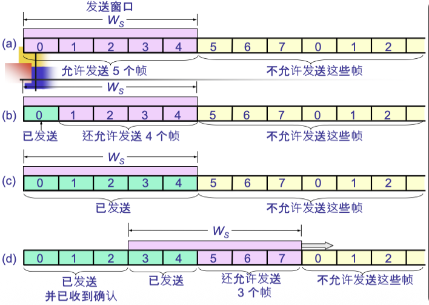

# 3.4.4 滑动窗口协议 (Sliding Window Protocol)

停-等协议的主要缺点是信道利用率极低，因为发送方在大部分时间里都在等待确认。为了克服这一缺点，诞生了**滑动窗口协议**，其核心思想是允许发送方**连续发送多个帧**，而无需每发一帧就停下来等待确认，从而让信道"忙起来"，这被称为**流水线 (Pipelining)** 技术。

### 核心概念

#### 1. 滑动窗口的概念

协议的发送方和接收方各自维护一个"窗口"，这个窗口是帧序号的一个范围。

##### 发送窗口 ($W_S$)

*   **定义**: 在发送端，一个包含了允许连续发送的帧序号的集合。
*   **大小 ($W_S$)**: 代表了在没有收到对方确认的情况下，发送方**最多可以连续发送的数据帧数量**。
*   **窗口内的帧状态**:
    1.  已发送但未收到确认的帧。
    2.  允许发送但尚未发送的帧。
*   **窗口的滑动**: 当发送方收到对窗口内最早发出的帧的确认后，窗口就可以向前（向右）滑动，以便可以发送新的帧。

**示例**：
```
序号: 0  1  2  3  4  5  6  7  8  9  10 11 12
状态: [已发|已发|已发|可发|可发] -- -- -- -- -- -- --
      ↑                         ↑
   窗口起始                  窗口结束
   (等待确认)              (可发送新帧)
```

##### 接收窗口 ($W_R$)

*   **定义**: 在接收端，一个包含了准备接收的帧序号的集合。
*   **功能**: 只有当收到的数据帧的序号落在接收窗口内时，该帧才会被接收。落在窗口外的帧将被丢弃。
*   **窗口的滑动**: 当接收方正确接收了一个或多个帧，并将其交付给网络层后，接收窗口向前滑动，准备接收后续的帧。

#### 2. 滑动窗口的重要特性

*   **流量控制**: 
    *   发送窗口的大小 $W_S$ 直接限制了发送方可以发送的未确认帧的数量。
    *   从而起到了流量控制的作用。
    
*   **可靠传输**: 
    *   通过帧序号、确认和超时重传机制（具体实现在 GBN 和 SR 中）。
    *   滑动窗口协议实现了可靠传输。
    
*   **窗口的联动**: 
    *   只有当接收窗口向前滑动（意味着接收方成功接收了数据并发出了确认）。
    *   发送窗口才**有可能**向前滑动。
    
*   **与停-等协议的关系**: 
    *   当发送窗口大小 $W_S=1$ 且接收窗口大小 $W_R=1$ 时。
    *   滑动窗口协议就退化成了**停-等协议**。

#### 3. 流水线技术的优势

*   **提高信道利用率**: 
    *   不再是"发一帧，等一帧"。
    *   而是"连续发送多帧，并行等待多个确认"。
    *   信道大部分时间都在传输数据。

*   **信道利用率分析**:
    *   假设发送窗口大小为 $W_S$，在理想情况下：
    *   当 $W_S \geq 1 + 2a$ 时（其中 $a = T_d/T_f$），信道利用率可以接近 100%。
    *   对比停-等协议的 $C_r = 1/(1+2a)$，提升显著。

#### 4. 捎带确认 (Piggybacking)

*   **背景**: 在全双工通信中，A 向 B 发送数据的同时，B 也可能在向 A 发送数据。

*   **原理**: 
    *   与其为收到的数据帧单独发送一个 ACK 帧。
    *   不如将这个确认信息"捎带"在 B 发往 A 的数据帧的头部。

*   **实现方式**:
    *   在数据帧的头部增加一个确认序号字段。
    *   该字段表示对接收到的帧的确认。

*   **优点**: 
    *   提高了信道利用率。
    *   减少了需要发送的帧的总数。
    *   降低了网络开销。

*   **注意**: 
    *   如果长时间没有反向数据传输，确认不能无限期等待。
    *   需要设置一个超时时间，超时后单独发送 ACK 帧。

### 易考点 & 难点

*   **易考点**:
    *   滑动窗口协议相比停-等协议的核心改进（流水线技术，连续发送）。
    *   发送窗口和接收窗口的基本概念和作用（流量控制）。
    *   停-等协议是滑动窗口协议的一个特例（$W_S=W_R=1$）。
    *   捎带确认的概念和优点。

*   **难点**:
    *   **窗口的动态滑动过程**: 
        *   理解发送窗口如何根据收到的 ACK 滑动。
        *   以及接收窗口如何根据收到的帧滑动。
        *   这是理解整个机制的关键。
    *   **流水线技术对信道利用率的影响**: 理解为何连续发送能大幅提高效率。
