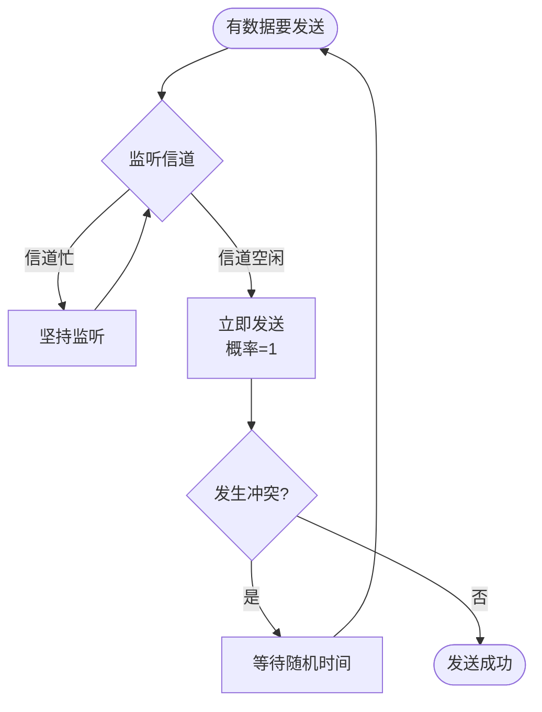
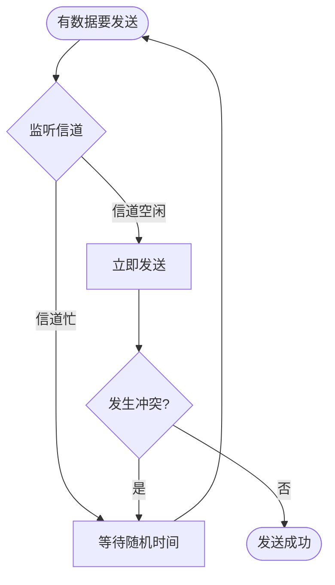
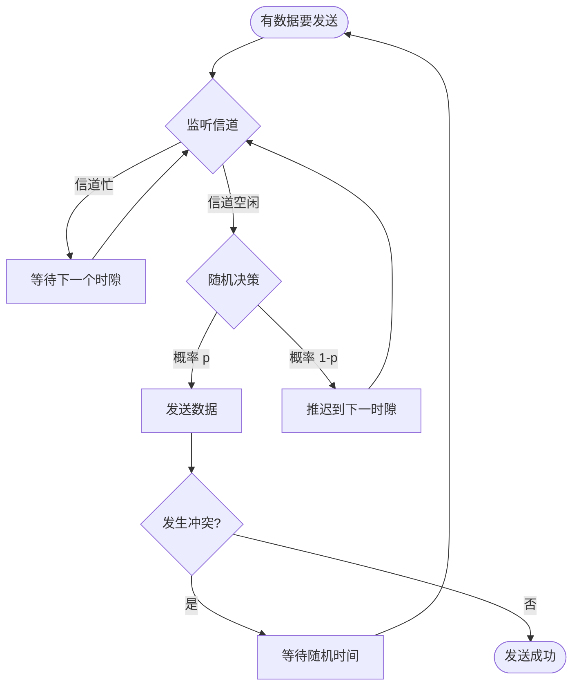
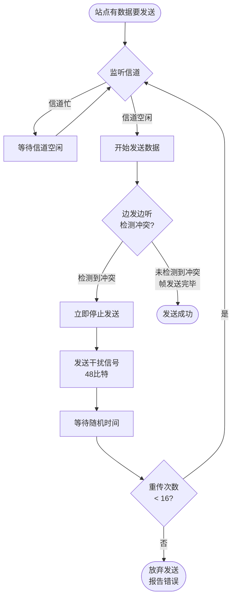

# 3.5.2 随机访问协议 (Random Access Protocols)

与静态划分不同，随机访问协议允许所有节点共享信道的全部带宽。节点可以根据自己的意愿**随机地**访问信道，但必须遵循一套规则来处理可能发生的**冲突**。

### 核心概念

#### 1. ALOHA 协议

这是最早的随机访问协议，诞生于 1970 年夏威夷大学，思想非常简单："想发就发"。

##### (1) 纯 ALOHA (Pure ALOHA)

*   **规则**: 
    *   任何站点有数据就直接发送，不做任何检测。
    *   发送后监听信道（实际是通过是否收到 ACK 来判断）。
    *   如果发生冲突（未收到 ACK），则等待一个**随机时间**后重传。

*   **冲突危险区**: 
    *   一个帧的发送时间为 $T$。
    *   只有当该帧发送**前**的 $T$ 时间内和发送**中**的 $T$ 时间内（共 $2T$）都没有其他站发送，才能成功。
    *   因此，冲突危险区长度为 $2T$。

**冲突示意图**：
```
时间线:
  |←── T ──→|←── T ──→|
  
站点A:        [====帧A====]
站点B:    [====帧B====]      ← B在A开始前的T时间内发送，冲突！
站点C:              [====帧C====]  ← C在A发送期间发送，冲突！

危险区: |←───── 2T ─────→|
```

*   **吞吐率**: 
    *   $S = G \cdot e^{-2G}$
    *   其中 $G$ 是网络负载（平均每帧发送时间内尝试发送的帧数）。
    *   **最大吞吐率**: $S_{max} = \frac{1}{2e} \approx 0.184 = 18.4\%$
    *   即使在最理想情况下，也只有不到 20% 的信道利用率。

*   **优点**: 
    *   实现极其简单。
    *   低负载时时延小。

*   **缺点**: 
    *   效率极低。
    *   冲突概率高。

##### (2) 时隙 ALOHA (Slotted ALOHA)

*   **改进**: 
    *   将时间划分为离散的**时隙**，长度等于一个帧的发送时间 $T$。
    *   所有站点只能在**时隙的开始时刻**才能发送数据。
    *   需要所有站点时钟同步。

*   **冲突危险区**: 
    *   冲突只可能发生在**同一个时隙**内。
    *   因此，危险区从 $2T$ 减少到了 $T$。

**时隙示意图**：
```
时隙:  |  1  |  2  |  3  |  4  |  5  |
       ↑     ↑     ↑     ↑     ↑
    只能在时隙开始时刻发送

站点A:      [帧A]
站点B:      [帧B]  ← 同一时隙发送，冲突
站点C:            [帧C]  ← 成功
```

*   **吞吐率**: 
    *   $S = G \cdot e^{-G}$
    *   **最大吞吐率**: $S_{max} = \frac{1}{e} \approx 0.368 = 36.8\%$
    *   是纯 ALOHA 的两倍。

*   **优点**: 
    *   相比纯 ALOHA，效率翻倍。
    *   仍然实现简单。

*   **缺点**: 
    *   需要时钟同步。
    *   效率仍然较低（浪费了 63% 的时隙）。

#### 2. 载波监听多路访问 (CSMA - Carrier Sense Multiple Access)

CSMA 是对 ALOHA 的改进，核心思想是 **"先听再说 (Listen Before Talk)"**。

##### 基本原理

*   **载波监听**: 
    *   站点在发送数据前，先**监听 (sense)** 信道。
    *   检测信道上是否有载波信号（即是否有其他站点在发送）。

*   **访问规则**:
    *   如果信道**空闲**，则发送。
    *   如果信道**忙**，则推迟发送。

##### 冲突原因

即使监听，冲突也无法完全避免，原因是**传播时延**：

*   信号在信道上传播需要时间 $\tau$（传播时延）。
*   可能 A 站发送的信号还没到达 B 站时，B 站监听到信道是空闲的。
*   B 站也开始发送，从而导致冲突。

**冲突示意图**：
```
时刻 t0: A站开始发送
      A ════════>
         信号传播中...

时刻 t0+τ/2: B站监听，信道空闲（A的信号还未到达）
      A ═══════════>
            B ════>  ← B也开始发送

时刻 t0+τ: 冲突发生！
      A ═════════════> 
            ⚡冲突⚡
            B ═══════>
```

##### 三种坚持策略

为了优化信道利用率和减少冲突，CSMA 有三种不同的坚持策略：

**(1) 1-坚持型 CSMA (1-persistent CSMA)**

*   **规则**:
    *   监听信道。
    *   如果信道**忙**，就**一直坚持监听**。
    *   一旦信道**空闲**，**立即发送**（概率为 1）。
    *   如果发生冲突，等待一个随机时间后重新开始。

*   **优点**: 
    *   减少了信道空闲时间。
    *   一旦信道空闲，立即利用。

*   **缺点**: 
    *   如果有多个站点在等待。
    *   一旦信道变空闲，它们会**同时发送**。
    *   导致冲突概率增大（"贪婪"策略）。

**1-坚持型 CSMA 流程图**：



**(2) 非坚持型 CSMA (Non-persistent CSMA)**

*   **规则**:
    *   监听信道。
    *   如果信道**空闲**，立即发送。
    *   如果信道**忙**，**不继续监听**。
    *   等待一个**随机时间**后，再回来重新监听。

*   **优点**: 
    *   减少了冲突概率。
    *   多个站点不会同时发送。

*   **缺点**: 
    *   增加了信道空闲时间。
    *   数据发送延迟增大。
    *   即使信道变空闲，可能也没有站点在监听。

**非坚持型 CSMA 流程图**：



**(3) p-坚持型 CSMA (p-persistent CSMA)**

*   **前提**: 用于**时隙信道**。

*   **规则**:
    *   监听信道。
    *   如果信道**忙**，则等待下一个时隙再监听。
    *   如果信道**空闲**：
        *   以概率 $p$ **发送**。
        *   以概率 $1-p$ **推迟**到下一个时隙再监听。
    *   如果发生冲突，等待随机时间后重新开始。

*   **特点**: 
    *   是前两种策略的**折中**。
    *   通过调整参数 $p$ 来平衡延迟和冲突。

*   **优点**: 
    *   兼顾了低延迟和低冲突。
    *   更灵活。

**p-坚持型 CSMA 流程图**：



#### 3. 带冲突检测的载波监听多路访问 (CSMA/CD)

CSMA/CD 是对 CSMA 的进一步改进，核心思想是 **"边听边说，一旦冲突，立即停说 (Listen While Talk)"**。

这是**传统以太网 (IEEE 802.3)** 使用的协议。

##### 工作流程

1.  **准备发送**: 
    *   站点有数据要发送。
    *   监听信道，若信道**忙**则等待。

2.  **发送**: 
    *   若信道**空闲**，则开始发送数据。

3.  **冲突检测 (边发边听)**:
    *   在**发送数据的同时**，持续监听信道。
    *   将信道上检测到的信号与自己发送的信号进行比较。
    *   如果发现**不一致**，说明发生了冲突。

4.  **处理冲突**:
    *   **立即停止**发送数据（不浪费时间）。
    *   发送一个简短的**人为干扰信号 (Jamming Signal, 48比特)**。
    *   确保所有卷入冲突的站点都能检测到冲突。
    *   执行**二进制指数退避算法**。
    *   等待一个随机时间后，返回步骤 1。

5.  **发送成功**: 
    *   如果整个帧发送完毕都没有检测到冲突。
    *   则发送成功。

**CSMA/CD 工作流程图**：



##### 争用期 (Contention Period) / 冲突窗口

*   **定义**: 
    *   一个站点**最多需要多长时间**才能确定自己发送的数据没有发生冲突？
    *   答案是**两倍的端到端传播时延 ($2\tau$)**。

*   **推导**:
    *   考虑最坏情况：
        *   站点 A 在 $t_0$ 时刻开始发送。
        *   A 的信号在 $t_0 + \tau - \epsilon$ 时刻即将到达站点 B（$\epsilon$ 为极小值）。
        *   此时 B 监听信道，认为空闲，开始发送。
        *   在 B 处立即发生冲突。
        *   冲突信号传播回 A，需要时间 $\tau$。
        *   A 在 $t_0 + 2\tau$ 时刻检测到冲突。

**时序图**：
```
时间轴:
  t0        t0+τ-ε    t0+τ      t0+2τ
  ↓           ↓         ↓          ↓
A:|═════════════════════════════>⚡检测到冲突
  |           |         |         |
  |     A的信号传播     |         |
  |           ↓         |         |
B:|           开始发送═>⚡冲突    |
  |                     |         |
  |             冲突信号传播回A   |
  |                     └─────────┘

争用期 = 2τ
```

*   **关键结论**: 
    *   如果一个站点发送数据后，经过了 $2\tau$ 的时间**仍未检测到冲突**。
    *   那么它就可以**确信**这次发送成功了（不会再发生冲突）。
    *   这个 $2\tau$ 时间段称为**争用期**或**碰撞窗口**。


### 易考点 & 难点

*   **易考点**:
    *   ALOHA、时隙 ALOHA、CSMA、CSMA/CD 协议的演进关系和核心思想。
    *   CSMA/CD 的工作流程（监听、发送、检测、退避）。
    *   争用期 $2\tau$ 的概念。
    *   最小帧长的意义。

*   **难点**:
    *   **CSMA/CD 的冲突检测原理**: 
        *   理解为什么**传播时延 $\tau$ 是导致冲突的根本原因**。
        *   这是因为信号传播需要时间，导致"先听再说"仍然可能冲突。
    
    *   **争用期 $2\tau$ 的概念**: 
        *   这是**本节的绝对核心和难点**。
        *   必须能解释：
            1. 为什么是 $2\tau$（最坏情况下的往返时延）
            2. 它和最小帧长之间的关系（$T_f \geq 2\tau$）
            3. 为什么超过 $2\tau$ 就不会再发生冲突
    
    *   **最小帧长的计算**: 
        *   能够根据给定的网络参数（速率、长度、传播速度）计算出最小帧长。
        *   **计算公式**: 最小帧长 = 数据传输速率 × $2\tau$
        *   这是常见的计算题类型。
    
    *   **二进制指数退避算法**: 
        *   理解算法如何通过**动态增加随机等待时间的范围**来解决冲突。
        *   能够计算第 $k$ 次重传时的等待时间范围。
