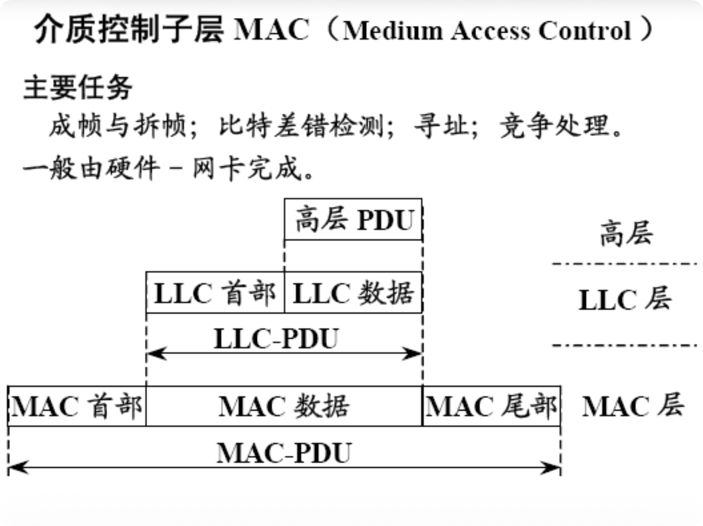

# 3.6.1 局域网的基本概念与体系结构

### 核心概念

#### 1. 局域网的关键技术（三要素）

构建一个局域网需要考虑三个核心技术要素：

##### (1) 拓扑结构 (Topology)

网络中节点和链路的物理或逻辑布局。

*   **总线型 (Bus)**：
    *   所有节点连接到一条公共总线上。
    *   任何节点发送的信号都会传播到整个总线。
    *   传统以太网采用此拓扑。

*   **星型 (Star)**：
    *   所有节点连接到一个中心节点（集线器或交换机）。
    *   现代以太网采用此拓扑。
    *   中心节点故障会导致整个网络瘫痪。

*   **环型 (Ring)**：
    *   节点连接成一个闭合的环。
    *   令牌环网采用此拓扑。
    *   数据沿着环单向传输。

*   **树型 (Tree)**：
    *   星型的扩展，形成层次结构。
    *   适合大型网络。

##### (2) 传输介质 (Transmission Medium)

承载数据信号的物理媒介。

*   **双绞线**：最常用，成本低，易安装。
*   **同轴电缆**：早期以太网使用，现已少见。
*   **光纤**：高速、长距离、抗干扰。
*   **无线电波**：Wi-Fi 使用。

##### (3) 介质访问控制方式 (MAC Method)

协调多个节点如何共享传输介质。

*   **CSMA/CD**：以太网采用。
*   **Token Ring**：令牌环网采用。
*   **Token Bus**：令牌总线网采用。
*   **CSMA/CA**：无线局域网采用。

#### 2. IEEE 802 参考模型

为了规范局域网技术，IEEE 802 委员会制定了一系列标准。其参考模型将 OSI 的数据链路层**划分**为两个子层。

**OSI 模型与 IEEE 802 模型的对应关系**：

a
```
┌──────────────────────┬──────────────────────┐
│      OSI 模型        │     IEEE 802 模型    │
├──────────────────────┼──────────────────────┤
│     ...上层协议...   │   网络操作系统 (NOS) │
├──────────────────────┼──────────────────────┤
│        网络层        │         网络层       │
├──────────────────────┼──────────────────────┤
│                      │  逻辑链路控制 (LLC)  │
│      数据链路层      ├──────────────────────┤
│                      │  媒体访问控制 (MAC)  │
├──────────────────────┼──────────────────────┤
│        物理层        │     物理层 (PHY)     │
└──────────────────────┴──────────────────────┘
```

#### 3. LLC 与 MAC 子层的划分原因与功能

##### 为何划分？

1.  **适配多种 MAC 协议**：
    *   局域网技术多种多样（以太网、令牌环、Wi-Fi 等）。
    *   它们的介质访问控制（MAC）方法和帧格式各不相同。
    *   为了让上层协议（如 IP）不必关心这些底层差异。
    *   需要一个**公共的接口层** —— LLC 子层。

2.  **隔离复杂性**：
    *   将与硬件和物理介质紧密相关的**介质访问控制**功能（MAC）。
    *   与相对独立的**逻辑控制**功能（LLC）分离开来。
    *   降低系统复杂度，提高可维护性。

##### 各子层功能

**(1) 物理层 (PHY)**

*   信号的编码与译码。
*   比特的传输与接收。
*   物理连接的建立、维护和释放。

**(2) 媒体访问控制 (MAC) 子层**

*   **主要任务**：
    *   **竞争处理**：实现 CSMA/CD、令牌传递等访问控制协议。
    *   **寻址**：使用 MAC 地址标识网络中的设备。
    *   **成帧与拆帧**：将数据封装成帧或从帧中提取数据。
    *   **比特差错检测**：使用 CRC 等方法检测传输错误。

*   **实现**：
    *   通常由硬件（网卡）完成。
    *   与具体的局域网技术紧密相关。

**(3) 逻辑链路控制 (LLC) 子层**

*   **主要任务**：
    *   **隐藏底层 MAC 协议的差异**。
    *   为网络层提供统一的接口。
    *   进行**差错控制**、**流量控制**和**帧序号管理**。

*   **实现**：
    *   提供服务访问点（SAP）。
    *   向上层提供服务。



#### 4. 逻辑链路控制子层 LLC (Logical Link Control)

##### 提供的三种服务

这与 3.1 节中数据链路层为网络层提供的服务相对应：

1.  **无确认的无连接服务**：
    *   这是**最常用**的一种。
    *   不保证可靠性。
    *   适用于误码率低的局域网。

2.  **有确认的无连接服务**：
    *   每一帧都单独确认。
    *   保证可靠性但开销大。
    *   适用于误码率较高的环境。

3.  **有确认的面向连接服务**：
    *   提供最可靠的服务。
    *   包括连接建立、数据传输和连接释放。
    *   开销最大。

##### LLC 帧结构 (基于 HDLC)

LLC 帧格式如下：

```
┌──────┬──────┬─────────┬────────┐
│ DSAP │ SSAP │ Control │  Data  │
│ 1字节│ 1字节│ 1-2字节 │ 可变   │
└──────┴──────┴─────────┴────────┘
```

*   **DSAP (Destination Service Access Point)**：
    *   目的服务访问点，1 字节。
    *   标识接收端上层的协议。

*   **SSAP (Source Service Access Point)**：
    *   源服务访问点，1 字节。
    *   标识发送端上层的协议。

*   **Control (控制字段)**：
    *   1 或 2 字节。
    *   用于流量控制、差错控制和帧序号管理。
    *   标识帧的类型（信息帧、监控帧、无编号帧）。

*   **数据 (Data)**：
    *   承载来自上层的数据。

#### 5. 介质访问控制子层 MAC (Medium Access Control)

##### 主要任务

将 LLC 递交下来的数据（LLC PDU）封装成 MAC 帧。

##### MAC 帧结构

在 LLC PDU 的基础上：
*   添加 **MAC 首部**（包含目的/源 MAC 地址等）。
*   添加 **MAC 尾部**（包含 FCS 帧检验序列）。

最终形成的 MAC-PDU（即以太网帧）交给物理层发送。


#### 6. IEEE 802 标准族

IEEE 802 委员会为不同的局域网技术制定了不同的标准：

| 标准 | 名称 | 描述 |
|:---|:---|:---|
| **802.1** | 概述与体系结构 | 网络互连（网桥、VLAN）等 |
| **802.2** | 逻辑链路控制 (LLC) | 所有 802 局域网通用 |
| **802.3** | **以太网** | 使用 CSMA/CD，最广泛 |
| **802.4** | 令牌总线网 | 已淘汰 |
| **802.5** | **令牌环网** | 曾经流行，现已少见 |
| **802.11** | **无线局域网 (Wi-Fi)** | 使用 CSMA/CA |
| **802.15** | 无线个人网 (WPAN) | 蓝牙等 |
| **802.16** | 宽带无线接入 (WiMAX) | 城域网 |

**重要标准记忆口诀**：
*   802.3 = **以太网** (Ethernet)
*   802.11 = **Wi-Fi** (Wireless Fidelity)
*   802.2 = **LLC** (所有局域网通用)

### 易考点 & 难点

*   **易考点**:
    *   局域网的**三要素**（拓扑、介质、MAC 方法）。
    *   IEEE 802 模型与 OSI 模型的对应关系。
    *   数据链路层被分为 **LLC 和 MAC** 两个子层。
    *   记住几个关键的标准号：
        *   802.2 = LLC
        *   802.3 = 以太网
        *   802.11 = Wi-Fi
    *   LLC 提供的三种服务类型。

*   **难点**:
    *   **深刻理解划分为两个子层的动机**：
        *   **核心在于"隔离"**。
        *   LLC 隔离了上层协议与底层具体的 MAC 实现。
        *   使得上层协议（如 IP）可以"一套代码跑遍所有网卡"。
        *   MAC 则专门处理与物理介质紧密相关的复杂访问控制问题。
    
    *   **LLC 和 MAC 的封装关系**：
        *   理解数据从网络层下来的完整封装过程：
            1. 网络层数据 → LLC 封装（添加 DSAP、SSAP、Control）→ LLC PDU
            2. LLC PDU → MAC 封装（添加 MAC 地址、FCS）→ MAC 帧
        *   理解接收方的反向解封装过程。
    
    *   **SAP (Service Access Point) 的作用**：
        *   DSAP 和 SSAP 用于标识上层协议。
        *   类似于端口号的概念，但工作在数据链路层。
        *   使得一个网卡可以同时为多个上层协议服务。
