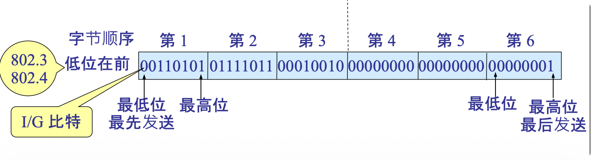

# 3.6.2 以太网 (Ethernet)

以太网是当今应用最广泛的局域网技术，其核心是使用 **CSMA/CD** 作为介质访问控制方法。

### 核心概念

#### 1. 拓扑结构演进

<table>
<thead>
<tr>
<th width="15%">特性</th>
<th width="42.5%">传统以太网<br/>(粗缆/细缆以太网)</th>
<th width="42.5%">现代以太网<br/>(双绞线以太网)</th>
</tr>
</thead>
<tbody>
<tr>
<td><strong>拓扑结构</strong></td>
<td>总线型</td>
<td>星型</td>
</tr>
<tr>
<td><strong>传输介质</strong></td>
<td>粗/细同轴电缆</td>
<td>双绞线</td>
</tr>
<tr>
<td><strong>介质特性</strong></td>
<td>所有计算机共享一根电缆<br/>真正的共享介质</td>
<td>每台设备独立连接到中心设备</td>
</tr>
<tr>
<td><strong>中心设备</strong></td>
<td>无</td>
<td>
• <strong>集线器 (Hub)</strong>：物理层设备，简单转发信号，仍是共享介质<br/>
• <strong>交换机 (Switch)</strong>：数据链路层设备，全双工通信
</td>
</tr>
<tr>
<td><strong>CSMA/CD</strong></td>
<td>必须使用</td>
<td>• Hub：需要<br/>• Switch：<strong>不需要</strong></td>
</tr>
<tr>
<td><strong>优点</strong></td>
<td>结构简单</td>
<td>• 安装维护方便<br/>• 故障隔离好<br/>• 是当前主流</td>
</tr>
<tr>
<td><strong>缺点</strong></td>
<td>• 安装维护困难<br/>• 一处故障影响整网<br/>• 已基本淘汰</td>
<td>需要中心设备</td>
</tr>
</tbody>
</table>

**拓扑演进示意图**：

```
传统以太网（总线型）:
┌────┬────┬────┬────┐
│ A  │ B  │ C  │ D  │  ← 所有设备连接到同一条总线
└────┴────┴────┴────┘
      同轴电缆

现代以太网（星型）:
        集线器/交换机
           ╱│╲
          ╱ │ ╲
         A  B  C D  ← 每个设备独立连接到中心
         双绞线
```

#### 2. MAC 地址（硬件地址/物理地址）

##### 基本概念

*   **定义**：
    *   固化在网卡 ROM 中的、全球唯一的 48 位地址。
    *   也称为**硬件地址**、**物理地址**、**以太网地址**。

*   **格式**：
    *   48 位 = 6 字节。
    *   通常用十六进制表示，如：`00-1A-2B-3C-4D-5E` 或 `00:1A:2B:3C:4D:5E`。

##### 地址结构

```
┌────────────────────────┬────────────────────────┐
│    前 24 位 (3 字节)   │   后 24 位 (3 字节)    │
│  组织唯一标识符 (OUI)  │  网络接口标识符 (NIC)  │
│   由 IEEE 统一分配     │   由制造商自行分配     │
└────────────────────────┴────────────────────────┘

示例: 00-1A-2B-3C-4D-5E
      └──┬──┘ └──┬──┘
       OUI      NIC
```

*   **OUI (Organizationally Unique Identifier)**：
    *   前 24 位，由 IEEE 分配给网卡制造商。
    *   每个制造商有唯一的 OUI。

*   **NIC (Network Interface Controller)**：
    *   后 24 位，由制造商自行分配。
    *   保证该制造商生产的网卡有唯一地址。



##### 目标地址类型
*   **单播地址 (Unicast)**：
    *   第一字节的最低位为 0。
    *   一对一通信。
    *   目标是一个特定的网卡。

*   **广播地址 (Broadcast)**：
    *   所有 48 位都是 1。
    *   表示为：`FF-FF-FF-FF-FF-FF`。
    *   一对全体通信。
    *   网络中的所有设备都会接收。

*   **多播地址 (Multicast)**：
    *   第一字节的最低位为 1。
    *   一对多通信。
    *   目标是一组设备。

**地址类型识别**：

```
单播: 00-1A-2B-3C-4D-5E
      ↑
      第一字节 = 0x00 (二进制: 00000000)
                                      ↑ 最低位为 0

广播: FF-FF-FF-FF-FF-FF (全1)

多播: 01-00-5E-xx-xx-xx
      ↑
      第一字节 = 0x01 (二进制: 00000001)
                                      ↑ 最低位为 1
```

#### 3. 以太网 V2 MAC 帧格式

这是最常用的以太网帧格式，也称为 **Ethernet II** 或 **DIX 以太网**（DEC、Intel、Xerox 三家公司制定）。

##### 完整帧结构

```
┌─────────┬─────┬─────────┬─────────┬──────┬──────────┬─────┐
│Preamble │ SFD │  目的   │   源    │ 类型 │   数据   │ FCS │
│  7字节  │1字节│  地址   │  地址   │2字节 │ 46-1500  │4字节│
│         │     │  6字节  │  6字节  │      │   字节   │     │
└─────────┴─────┴─────────┴─────────┴──────┴──────────┴─────┘
 ←------ 不计入帧长 -----→ ←---------- 计入帧长 ------------→
```

##### 各字段详解

| 字段 | 字节数 | 描述 |
|:---|:---:|:---|
| **前同步码<br/>(Preamble)** | 7 | • `10101010` 重复 7 次<br/>• 用于让接收方实现**比特同步**<br/>• 提示有帧到来 |
| **帧开始定界符<br/>(SFD)** | 1 | • `10101011`<br/>• 标志着帧的**正式开始**<br/>• 最后两个 `11` 表示后面是真正的帧数据 |
| **目的地址<br/>(Destination)** | 6 | • 接收方的 MAC 地址<br/>• 可以是单播、广播或多播地址 |
| **源地址<br/>(Source)** | 6 | • 发送方的 MAC 地址<br/>• 必须是单播地址 |
| **类型<br/>(Type/EtherType)** | 2 | • 指明上层（网络层）使用的协议<br/>• `0x0800` = IPv4<br/>• `0x0806` = ARP<br/>• `0x86DD` = IPv6<br/>• 接收方根据此字段决定将数据交给哪个上层协议处理 |
| **数据<br/>(Data)** | 46-1500 | • 存放网络层递交下来的数据报（如 IP 数据报）<br/>• **最大值 1500 字节**，称为**最大传输单元 (MTU)**<br/>• **最小值 46 字节**，为了保证帧长不小于 64 字节<br/>• 如果上层数据不足 46 字节，需要**填充 (Padding)** |
| **帧检验序列<br/>(FCS)** | 4 | • 使用 CRC-32 循环冗余码进行差错校验<br/>• 校验范围：从目的地址到数据字段<br/>• 不包括前同步码和 SFD |

##### 帧长度限制

*   **最小帧长**：
    *   6 (目的) + 6 (源) + 2 (类型) + 46 (数据) + 4 (FCS) = **64 字节**
    *   不包括前同步码和 SFD

*   **最大帧长**：
    *   6 + 6 + 2 + 1500 + 4 = **1518 字节**
    *   不包括前同步码和 SFD

*   **完整帧长**：
    *   如果包括前同步码 (7) 和 SFD (1)：
    *   最小：72 字节
    *   最大：1526 字节

##### 最小帧长的重要性 ⭐⭐⭐

**为什么规定最小帧长为 64 字节？**

这与 **CSMA/CD 的争用期** 有直接关系：

1.  **争用期** = $2\tau$（双程传播时延）
2.  在争用期内，站点必须持续发送，才能检测到可能发生的冲突
3.  因此：**帧的发送时间 $T_f$ ≥ 争用期 $2\tau$**

**推导公式**：

$$T_f = \frac{\text{帧长（比特）}}{\text{数据传输速率（bps）}} \geq 2\tau = 2 \times \frac{\text{最大网段长度（m）}}{\text{信号传播速度（m/s）}}$$

因此：

$$\text{最小帧长（比特）} \geq \text{数据传输速率（bps）} \times 2\tau$$

**经典以太网示例**：

*   **参数**：
    *   数据传输速率 = 10 Mbps
    *   最大网段长度 = 2500 m
    *   信号传播速度 ≈ $2 \times 10^8$ m/s（在电缆中约为光速的 2/3）

*   **计算**：
    *   $\tau = \frac{2500}{2 \times 10^8} = 12.5 \mu s$
    *   $2\tau = 25 \mu s$
    *   最小帧长 = $10 \times 10^6 \times 25 \times 10^{-6} = 250$ 比特

*   **实际规定**：
    *   考虑到各种延迟和安全裕度
    *   规定最小帧长为 **512 比特 = 64 字节**
    *   对应的 $2\tau \approx 51.2 \mu s$

**重要结论**：

*   任何**小于 64 字节**的帧都被认为是**冲突碎片 (Collision Fragment)**。
*   这些帧会被**直接丢弃**，不会被上层协议处理。
*   这就是为什么数据字段最小为 46 字节（加上 14 字节的首部和 4 字节的 FCS，正好 64 字节）。

#### 4. 无效的 MAC 帧

接收方收到帧后，会因以下情况将其作为无效帧而丢弃：

1.  **帧的长度不是整数个字节**（比特数不是 8 的倍数）。
2.  **FCS 校验出错**（数据在传输中发生了错误）。
3.  **帧的数据字段长度不在 46-1500 字节之间**：
    *   导致总帧长不在 64-1518 字节之间。
    *   太短：可能是冲突碎片。
    *   太长：可能是故障或攻击。
4.  **收到的不是发给自己的帧**（目的 MAC 地址不匹配，且不是广播/多播）。

**重要说明**：

*   以太网只负责**检测错误和丢弃无效帧**。
*   **不负责重传**！
*   可靠性由上层协议（如 TCP）保证。
*   这体现了**端到端原则** (End-to-End Principle)。

#### 5. 帧间最小间隔 (Interframe Gap, IFG)

*   **定义**：
    *   规定帧与帧之间必须有至少 **9.6 µs** 的时间间隔。
    *   相当于发送 96 比特的时间（在 10 Mbps 以太网上）。

*   **目的**：
    *   让接收设备有时间清理缓存。
    *   准备接收下一帧。
    *   避免帧背靠背到达导致的丢失。

*   **不同速率下的 IFG**：
    *   10 Mbps：9.6 µs（96 比特时间）
    *   100 Mbps：0.96 µs（96 比特时间）
    *   1 Gbps：0.096 µs（96 比特时间）
    *   **规律**：IFG 总是 **96 比特时间**

### 易考点 & 难点

*   **易考点**:
    *   MAC 地址的**位数** (48 位)、**结构** (OUI + NIC) 和**分类**（单播、广播、多播）。
    *   以太网 V2 帧的各个字段**名称**和**字节数**。
    *   广播地址：`FF-FF-FF-FF-FF-FF`。
    *   最小帧长：**64 字节**。
    *   最大帧长：**1518 字节**。
    *   MTU：**1500 字节**。
    *   帧间间隔：**9.6 µs** 或 **96 比特时间**。

*   **难点**:
    *   **最小帧长限制的深层原因** ⭐⭐⭐：
        *   这是**绝对的重点和难点**。
        *   必须能够清晰地解释：
            1. **最小帧长 (64 字节)** 与 **CSMA/CD 的争用期 ($2\tau$)** 之间的关系
            2. 为什么需要 $T_f \geq 2\tau$（确保在发送完帧之前能检测到冲突）
            3. 能够根据给定参数计算最小帧长
        *   **计算公式**：
            $$\text{最小帧长（比特）} = \text{数据传输速率（bps）} \times 2\tau$$
            $$2\tau = 2 \times \frac{\text{网段长度（m）}}{\text{传播速度（m/s）}}$$
    
    *   **数据字段的长度范围 (46-1500)**：
        *   理解 **1500 是 MTU 的限制**（一次最多传输的数据量）。
        *   理解 **46 是为了满足最小帧长 64 字节**而进行的**填充 (Padding)** 要求。
        *   如果上层数据不足 46 字节，必须填充到 46 字节。
        *   填充的字节在接收端会被丢弃。
    
    *   **类型字段的作用**：
        *   理解类型字段是如何实现**协议复用**的。
        *   一个网卡可以同时为多个上层协议（IPv4、IPv6、ARP 等）服务。
        *   通过类型字段，接收方知道应该把数据交给哪个上层协议处理。
    
    *   **以太网的不可靠性**：
        *   理解以太网只提供"**尽力而为**"的服务。
        *   不保证可靠传输（丢弃错误帧，不重传）。
        *   可靠性由上层（TCP）保证。
