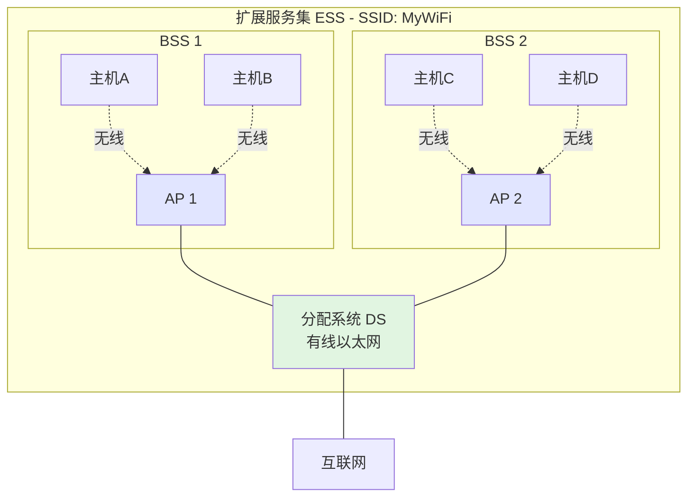
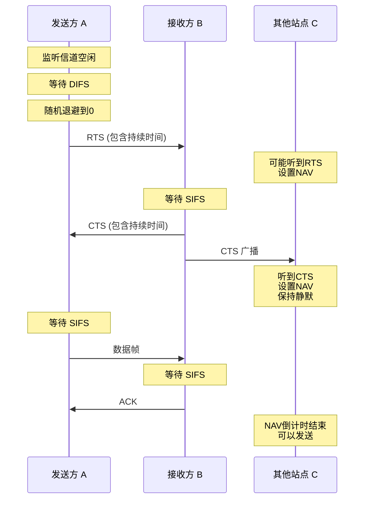

# 3.6.3 无线局域网 (Wireless LAN, WLAN)

WLAN（最常见的即 Wi-Fi）使用无线电波作为传输介质,其 MAC 层协议与有线以太网有很大不同。

### 核心概念

#### 1. 无线网络要素与模式

##### 基本要素

*   **无线主机 (Wireless Host)**：
    *   笔记本电脑、智能手机、平板等终端设备。
    *   配备无线网卡。

*   **基站/接入点 (Base Station / Access Point, AP)**：
    *   连接无线主机和有线网络的桥梁。
    *   负责在无线和有线网络之间转发帧。

*   **无线链路 (Wireless Link)**：
    *   使用无线电波传输数据。
    *   易受干扰、衰减和多径效应影响。

##### 两种工作模式

**(1) 基础设施模式 (Infrastructure Mode)**

*   **特点**：
    *   **最常见**的模式。
    *   所有无线主机通过 AP 接入有线网络。
    *   AP 就像一个无线的集线器/交换机。

*   **通信方式**：
    *   主机之间不能直接通信。
    *   必须经过 AP 转发。

**示意图**：

```
有线网络
   |
   |
  AP (接入点)
 / | \
A  B  C  ← 无线主机
```

**(2) 自组织模式 (Ad hoc Mode)**

*   **特点**：
    *   **无 AP**。
    *   主机之间直接通信。
    *   自组织、自配置。

*   **应用**：
    *   临时网络。
    *   应急通信。
    *   较少使用。

**示意图**：

```
A ←→ B
↕   ↕
C ←→ D  ← 所有主机对等，直接通信
```

#### 2. 802.11 体系结构

##### 基本概念

*   **基本服务集 (BSS - Basic Service Set)**：
    *   一个 AP 和与其关联的若干无线主机。
    *   BSS 是无线局域网的基本构建模块。

*   **服务集标识符 (SSID - Service Set Identifier)**：
    *   BSS 的网络名称（最多 32 字节）。
    *   就是我们在手机上看到的 Wi-Fi 名称。
    *   如："TP-LINK_1234"、"ChinaNet"等。

*   **分配系统 (DS - Distribution System)**：
    *   连接多个 AP 的骨干网（通常是有线以太网）。
    *   使得不同 BSS 之间可以通信。

*   **扩展服务集 (ESS - Extended Service Set)**：
    *   多个 BSS 通过 DS 连接而成。
    *   它们使用**相同的 SSID**。
    *   支持**漫游 (Roaming)**：主机可以在不同 AP 之间移动而保持连接。

**体系结构示意图**：



##### 关联 (Association)

*   **定义**：
    *   无线主机使用 AP 前必须先与其建立**关联**。
    *   类似于"注册"到 AP。

*   **过程**：
    1.  **被动扫描**：主机监听 AP 周期发送的**信标帧 (Beacon Frame)**。
    2.  **主动扫描**：主机广播**探测请求帧**，AP 回应**探测响应帧**。
    3.  **选择 AP**：主机选择信号最强的 AP。
    4.  **发送关联请求**：主机向选定的 AP 发送关联请求帧。
    5.  **关联响应**：AP 回应关联响应帧，分配关联 ID。

*   **重关联 (Reassociation)**：
    *   主机移动到另一个 BSS 时。
    *   与新的 AP 建立关联。
    *   实现漫游。

#### 3. 无线局域网的 MAC 层挑战

##### 为什么 CSMA/CD 不适用？

CSMA/CD 协议**不适用**于无线环境，原因有两个：

**(1) 冲突检测困难**

*   **有线网络**：
    *   发送方可以边发送边监听。
    *   检测信道上的信号是否与自己发送的一致。

*   **无线网络**：
    *   发送信号的强度远大于接收信号的强度（可能相差 $10^6$ 倍）。
    *   发送方的强信号会"淹没"来自其他站点的弱信号。
    *   **无法有效检测冲突**。

**(2) 隐蔽站和暴露站问题**

这是无线网络特有的问题，由信号传播范围有限导致。

**隐蔽站问题 (Hidden Terminal Problem)**：

```
传播范围示意:
  (A)  ←→  (B)  ←→  (C)
   •───────•───────•
   
情况:
- A 和 C 都在 B 的通信范围内
- 但 A 和 C 互相不在对方的通信范围内（听不到对方）

问题:
1. A 向 B 发送数据
2. C 监听信道，听不到 A 的信号
3. C 认为信道空闲，也向 B 发送
4. 在 B 处发生冲突！
5. 但 A 和 C 都无法检测到冲突
```

**暴露站问题 (Exposed Terminal Problem)**：

```
传播范围示意:
  (A)  ←→  (B)  ←→  (C)  ←→  (D)
   •───────•───────•───────•
   
情况:
1. B 正在向 A 发送数据
2. C 想向 D 发送数据
3. C 监听信道，听到了 B 的信号
4. C 认为信道忙，不敢发送
5. 实际上 C→D 的传输不会干扰 B→A
6. C 的推迟发送是不必要的，降低了信道利用率
```

#### 4. CSMA/CA 协议 (Collision Avoidance)

802.11 采用**带冲突避免的 CSMA (CSMA/CA)**，核心思想是**"尽量避免冲突"**而不是"检测冲突"。

##### 主要机制

**(1) 帧间间隔 (IFS - InterFrame Space)**

不同优先级的操作使用不同的等待时间：

*   **SIFS (Short IFS)**：
    *   **最短**，约 10 µs。
    *   用于高优先级操作：ACK、CTS。
    *   优先于其他帧发送。

*   **DIFS (Distributed Coordination Function IFS)**：
    *   **较长**，DIFS = SIFS + 2 × 时隙时间。
    *   约 50 µs。
    *   普通数据帧发送前的等待。

*   **EIFS (Extended IFS)**：
    *   **最长**。
    *   收到错误帧后使用，给发送方更多时间重传。

**优先级**：SIFS < DIFS < EIFS

**(2) 载波监听与退避**

发送数据的完整流程：

1.  **监听信道**。
2.  如果信道**忙**，继续监听直到空闲。
3.  信道**空闲**后，等待一个 **DIFS**。
4.  如果在 DIFS 期间信道保持空闲，进入**争用窗口**。
5.  启动**随机退避计时器**（从争用窗口中随机选择一个值）。
6.  **倒计时**：
    *   信道**空闲**时，计时器倒计时。
    *   信道**忙**时，计时器**冻结**（暂停）。
7.  计时器到 **0** 时，**发送数据**。

**为什么需要随机退避？**

*   即使信道空闲，也不立即发送。
*   而是随机等待一段时间。
*   **避免**多个站点在等待期间同时发送导致冲突。

**(3) 确认机制**

*   802.11 使用**停-等协议**。
*   **所有数据帧都必须被确认**。
*   接收方收到正确的帧后，等待一个 **SIFS**，然后回送 **ACK**。
*   发送方如果在超时时间内未收到 ACK，就重传。

**为什么需要确认？**

*   无线信道不可靠，容易出错。
*   无法检测冲突，只能通过 ACK 确认接收成功。

**(4) 虚拟载波监听 (RTS/CTS 机制)**

为解决**隐蔽站问题**，802.11 引入了 RTS/CTS 机制。

**工作流程**：

1.  **发送方**发送 **RTS (Request To Send)** 帧（很短）。
    *   包含发送方、接收方地址和数据传输持续时间。

2.  **接收方**收到 RTS 后，等待 SIFS，回送 **CTS (Clear To Send)** 帧。
    *   也包含传输持续时间。

3.  **所有听到 RTS 或 CTS 的站点**：
    *   根据其中的"持续时间"设置自己的 **NAV (Network Allocation Vector)**。
    *   在 NAV 指示的时间内保持**静默**，不发送数据。

4.  **发送方**收到 CTS 后，等待 SIFS，发送**数据帧**。

5.  **接收方**收到数据后，等待 SIFS，回送 **ACK**。

**RTS/CTS 解决隐蔽站问题**：

```
场景: A → B, C 是隐蔽站

1. A 发送 RTS
   - B 收到
   - C 听不到（在 A 范围外）

2. B 回送 CTS
   - A 收到
   - C 也收到！（C 在 B 范围内）

3. C 听到 CTS，设置 NAV，保持静默
   - 即使 C 听不到 A，也知道信道被占用

4. A 安全地发送数据给 B
```

**示意图**：



**NAV (Network Allocation Vector)**：

*   **虚拟载波监听**机制。
*   站点根据 RTS/CTS 中的持续时间字段计算 NAV。
*   NAV 倒计时到 0 之前，站点不会尝试发送。
*   即使物理信道看起来空闲，NAV 也会阻止发送。

**优缺点**：

*   **优点**：
    *   有效解决隐蔽站问题。
    *   减少数据帧冲突（短的 RTS/CTS 可能冲突，但代价小）。

*   **缺点**：
    *   增加了开销（RTS + CTS）。
    *   对于短帧，开销可能超过收益。

*   **使用策略**：
    *   通常只对超过某个门限长度的帧使用 RTS/CTS。
    *   短帧直接发送。

#### 5. 802.11 MAC 帧格式

802.11 的 MAC 帧比以太网复杂得多。

##### 帧类型

*   **管理帧**：信标、探测请求/响应、关联请求/响应等。
*   **控制帧**：RTS、CTS、ACK 等。
*   **数据帧**：传输用户数据。

##### 数据帧结构（简化）

```
┌────────┬────────┬────────┬────────┬────────┬────────┬──────┬─────┐
│ 帧控制 │ 持续时 │ 地址1  │ 地址2  │ 地址3  │ 序列控 │ 数据 │ FCS │
│ 2字节  │ 间 2字节│ 6字节  │ 6字节  │ 6字节  │ 制 2字节│      │4字节│
└────────┴────────┴────────┴────────┴────────┴────────┴──────┴─────┘
                            (可能还有地址4)
```

**为什么有多个地址字段？**

无线网络中，一个帧可能涉及四个地址：

1.  **接收方 (Receiver)**：直接接收帧的无线设备（可能是 AP）。
2.  **发送方 (Transmitter)**：直接发送帧的无线设备。
3.  **目的地址 (Destination)**：最终目的主机。
4.  **源地址 (Source)**：最初的源主机。

**示例场景**：

```
主机A (无线) → AP1 → 有线网络 → AP2 → 主机B (无线)

从A到AP1的帧:
- 地址1 (接收方): AP1的MAC
- 地址2 (发送方): A的MAC
- 地址3 (目的地): B的MAC

从AP2到B的帧:
- 地址1 (接收方): B的MAC
- 地址2 (发送方): AP2的MAC
- 地址3 (源地址): A的MAC
```

### CSMA/CA 与 CSMA/CD 的对比

| 特性 | CSMA/CD<br/>(有线以太网) | CSMA/CA<br/>(无线局域网) |
|:---|:---|:---|
| **核心思想** | 边发边听，**检测**冲突 | 尽量**避免**冲突 |
| **发送前** | 监听信道 | 监听信道 + 等待DIFS + 随机退避 |
| **发送中** | 持续监听，检测冲突 | 无法有效检测冲突 |
| **冲突处理** | 检测到立即停止，发送干扰信号 | 依赖ACK确认，超时重传 |
| **确认机制** | 无需确认 | **必须确认**（停-等） |
| **RTS/CTS** | 不需要 | 可选使用（解决隐蔽站） |
| **退避算法** | 二进制指数退避 | 随机退避（争用窗口） |
| **帧间间隔** | 固定的IFG (9.6µs) | 分优先级的IFS (SIFS/DIFS) |

### 易考点 & 难点

*   **易考点**:
    *   CSMA/CD **不适用**于无线网的两大原因（冲突检测困难、隐蔽站暴露站）。
    *   **隐蔽站**和**暴露站**问题的定义和示例。
    *   CSMA/CA 的核心思想（**避免冲突**）。
    *   RTS/CTS 机制的作用（解决**隐蔽站问题**）。
    *   NAV 的概念（虚拟载波监听）。
    *   SIFS 和 DIFS 的优先级关系。

*   **难点**:
    *   **CSMA/CA 的完整工作流程** ⭐⭐⭐：
        *   这是**本节的绝对核心**。
        *   必须深刻理解：
            1. IFS（特别是 DIFS 和 SIFS）的作用和优先级
            2. 争用窗口的概念
            3. 随机退避计时器的**倒计时和冻结机制**
            4. 为什么需要随机退避（避免同时发送）
            5. 确认机制（停-等协议）
    
    *   **RTS/CTS 机制的详细过程** ⭐⭐⭐：
        *   能够清晰地解释 RTS/CTS 是如何通过 NAV 来解决隐蔽站问题的。
        *   理解完整的交互过程：RTS → CTS → DATA → ACK
        *   理解为什么短帧不使用 RTS/CTS（开销问题）
    
    *   **与 CSMA/CD 的全面对比**：
        *   能够清晰地列出 CSMA/CA 和 CSMA/CD 的区别。
        *   理解为什么无线网络需要完全不同的 MAC 协议。
    
    *   **802.11 帧的多地址问题**：
        *   理解为什么需要多个地址字段。
        *   能够分析不同场景下各地址字段的含义。
