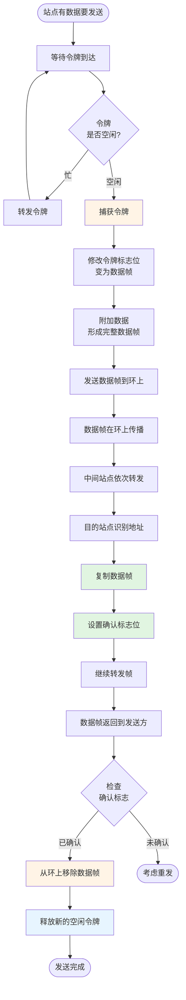

# 3.6.4 令牌环网 (Token Ring)

令牌环网是一种基于**令牌传递 (Token Passing)** 机制的局域网技术,在20世纪80-90年代曾广泛应用,由 IBM 推出,标准为 **IEEE 802.5**。

### 核心概念

#### 1. 令牌环网的基本结构

##### 物理拓扑与逻辑拓扑

*   **逻辑拓扑**：**环形 (Ring)**
    *   数据沿着环**单向**流动。
    *   每个站点从上游接收数据,向下游发送数据。

*   **物理拓扑**：**星形 (Star)**
    *   实际连接采用**集中器 (Concentrator)**,也称为 MAU (Multistation Access Unit)。
    *   各站点通过双绞线连接到集中器。
    *   集中器内部实现环形连接。

**优点**：

*   物理星形便于管理和故障隔离。
*   某站点故障时,集中器可以将其从环中断开,不影响整个网络。

**示意图**：

```
逻辑拓扑(环形):          物理拓扑(星形):
    A                        MAU
    ↓                      /  |  \
D ← → B                  A   B   C
    ↑                      \  |  /
    C                        D
```

#### 2. 令牌 (Token)

##### 令牌是什么?

*   令牌是一个**特殊的控制帧**,很短(通常 3 字节)。
*   格式简化示意:
    ```
    ┌──────────┬──────────┬──────────┐
    │ 起始定界符│ 访问控制 │ 结束定界符│
    │   1字节   │   1字节   │   1字节   │
    └──────────┴──────────┴──────────┘
    ```

*   **访问控制字节**包含一个"令牌/数据"标志位:
    *   `0` 表示**空闲令牌 (Free Token)**,可以被捕获。
    *   `1` 表示**数据帧**,正在传输数据。

##### 令牌的作用

*   **控制介质访问权**。
*   只有持有令牌的站点才能发送数据。
*   令牌在环上**循环传递**。

#### 3. 令牌传递机制

##### 基本工作流程

1.  **空闲状态**：
    *   环上循环传递一个**空闲令牌**。
    *   各站点依次接收并转发令牌。

2.  **站点要发送数据**：
    *   等待**空闲令牌**到达。
    *   **捕获令牌** (移除令牌,不再转发)。
    *   修改令牌的标志位,变成**数据帧的起始**。
    *   附加数据,形成完整的**数据帧**。
    *   将数据帧发送到环上。

3.  **数据帧在环上传播**：
    *   经过每个站点,各站点依次转发。
    *   **目的站点**识别自己的地址:
        *   **复制数据帧** (保存到缓冲区)。
        *   在帧中设置**确认标志位**。
        *   继续转发该帧。

4.  **数据帧返回发送方**：
    *   发送方识别出这是自己发送的帧 (检查源地址)。
    *   检查确认标志,确认目的站是否成功接收。
    *   **从环上移除该数据帧**。
    *   **释放新的空闲令牌**到环上。

5.  **令牌继续传递**：
    *   下一个有数据要发送的站点可以捕获令牌。
    *   循环往复。

##### 流程图



#### 4. 令牌环网的关键特性

##### (1) 确定性访问

*   每个站点都有**公平的机会**获得令牌。
*   最大等待时间是**可预测的**:
    $$T_{\text{max}} = n \times T_{\text{持有}}$$
    其中 $n$ 是站点数,$T_{\text{持有}}$ 是单个站点的最大令牌持有时间。

*   适合实时性要求高的应用 (如工业控制)。

##### (2) 无冲突

*   任何时刻只有持有令牌的站点可以发送。
*   **不会发生冲突**。
*   对比:
    *   以太网的 CSMA/CD: 可能冲突,性能不稳定。
    *   令牌环: 无冲突,性能稳定可预测。

##### (3) 高负载下性能优势

*   **轻负载时**:
    *   大部分时间令牌在空转。
    *   等待令牌有延迟。
    *   性能不如以太网 (以太网在轻负载时几乎无冲突,立即发送)。

*   **重负载时**:
    *   几乎总有站点需要发送。
    *   令牌被充分利用。
    *   无冲突,信道利用率可接近 **100%**。
    *   以太网在重负载时冲突频繁,性能急剧下降。

**性能对比图 (示意)**:

```
信道利用率
 100% ┤        令牌环 ────────────
      │       ╱
      │      ╱
  50% ┤     ╱   以太网
      │    ╱        ╲
      │   ╱          ╲___________
   0% └──┴──────────┴────────────> 负载
       低          中          高
```

##### (4) 优先级机制

802.5 令牌环支持优先级:

*   令牌中有**优先级字段**。
*   站点只能捕获优先级不高于自己的令牌。
*   高优先级站点可以"预约"下一个令牌。
*   允许实现**服务质量 (QoS)** 保证。

##### (5) 监控站

环网中有一个**主动监控站 (Active Monitor)**:

*   **职责**:
    *   确保环上只有一个令牌。
    *   检测并修复"丢失令牌"问题 (如果令牌丢失,生成新令牌)。
    *   检测并移除"孤儿帧" (发送方故障未能移除的数据帧)。
    *   维护环的时钟同步。

*   **选举**:
    *   网络启动时,通过选举确定监控站。
    *   通常是最先启动或优先级最高的站点。
    *   如果监控站故障,重新选举。

#### 5. 令牌环网的数据帧格式

```
┌────┬────┬────┬──────┬──────┬──────┬─────┬────┬────┐
│ SD │ AC │ FC │ 目的 │ 源地 │ 数据 │ FCS │ ED │ FS │
│    │    │    │ 地址 │  址  │      │     │    │    │
│ 1B │ 1B │ 1B │  6B  │  6B  │ 变长 │ 4B  │ 1B │ 1B │
└────┴────┴────┴──────┴──────┴──────┴─────┴────┴────┘
```

**字段说明**:

*   **SD (Starting Delimiter, 起始定界符)**:
    *   标志帧的开始。
    *   包含特殊的曼彻斯特编码违例,用于帧同步。

*   **AC (Access Control, 访问控制)**:
    *   **令牌/数据标志位**: 区分令牌和数据帧。
    *   **优先级位**: 表示帧的优先级。
    *   **预约位**: 用于高优先级站点预约令牌。
    *   **监控位**: 监控站使用,检测循环帧。

*   **FC (Frame Control, 帧控制)**:
    *   指示帧的类型 (MAC 控制帧 或 LLC 数据帧)。

*   **目的地址** 和 **源地址**:
    *   48 位 MAC 地址。

*   **数据**:
    *   可变长度的用户数据。

*   **FCS (Frame Check Sequence)**:
    *   32 位 CRC 校验。

*   **ED (Ending Delimiter, 结束定界符)**:
    *   标志帧的结束。
    *   包含**中间帧标志**和**错误检测标志**。

*   **FS (Frame Status, 帧状态)**:
    *   **地址识别位**: 目的站点设置,表示已识别地址。
    *   **帧复制位**: 目的站点设置,表示已复制帧。
    *   这两个位用于确认,是 802.5 的独特设计。
    *   因为在帧尾,不受 FCS 保护 (FCS 已经计算完了)。

#### 6. 令牌环网的故障处理

##### 主要故障类型

**(1) 令牌丢失**

*   **原因**:
    *   持有令牌的站点突然故障,未能释放令牌。
    *   令牌在传输中被噪声破坏。

*   **检测**:
    *   监控站设定一个**超时定时器**。
    *   如果在超时时间内未见令牌通过,判定令牌丢失。

*   **处理**:
    *   监控站发送一个新的空闲令牌。

**(2) 孤儿帧**

*   **原因**:
    *   发送方在数据帧返回前故障,未能移除帧。
    *   帧在环上不断循环。

*   **检测**:
    *   监控站在每个接收的帧的 **AC 字段**中设置**监控位**。
    *   如果一个帧第二次经过监控站,监控位已被设置,判定为孤儿帧。

*   **处理**:
    *   监控站从环上移除该帧。

**(3) 持续忙令牌**

*   **原因**:
    *   持有令牌的站点忙于处理,未能及时释放令牌。
    *   或者令牌的标志位被错误设置为"忙"。

*   **检测**:
    *   监控站的超时机制。

*   **处理**:
    *   强制生成新的空闲令牌。

##### 监控站的重要性

*   令牌环网的**稳定性**高度依赖监控站。
*   监控站故障会导致整个环网瘫痪 (直到重新选举)。
*   这是令牌环网的一个**单点故障**风险。

### 令牌环网 vs. 以太网

| 特性 | 令牌环网 (802.5) | 以太网 (802.3) |
|:---|:---|:---|
| **拓扑结构** | 逻辑环形,物理星形 | 总线/星形 |
| **介质访问** | 令牌传递 | CSMA/CD |
| **是否冲突** | **无冲突** | 可能冲突 |
| **性能稳定性** | 高,可预测 | 不稳定,取决于负载 |
| **轻负载性能** | 一般 (需等待令牌) | 优秀 (立即发送) |
| **重负载性能** | 优秀 (接近100%) | 较差 (冲突频繁) |
| **确定性** | 强 (最大延迟可预测) | 弱 (无法保证) |
| **优先级** | 支持 | 不支持 |
| **实现复杂度** | 高 | 低 |
| **成本** | 高 | 低 |
| **故障隔离** | 较好 (集中器) | 一般 |
| **单点故障** | 有 (监控站) | 无 |
| **现状** | 基本淘汰 | **主流** |

### 令牌环网的衰落

尽管令牌环网有诸多技术优势,但在市场竞争中败给了以太网:

**(1) 成本因素**

*   令牌环网卡、集中器 (MAU) 价格昂贵。
*   以太网设备大规模生产,价格低廉。

**(2) 协议复杂性**

*   令牌环网的令牌传递、监控站、优先级等机制复杂。
*   以太网协议简单,易于实现。

**(3) 以太网的技术进步**

*   **全双工以太网 + 交换机**:
    *   彻底解决了冲突问题。
    *   性能不再受负载影响。
    *   保留了以太网的简单性和低成本。

*   **速率提升**:
    *   快速以太网 (100 Mbps)、千兆以太网 (1 Gbps)、万兆以太网 (10 Gbps)……
    *   速率快速超越令牌环网。

**(4) 市场占有率**

*   以太网在 PC 领域率先普及。
*   令牌环网主要在 IBM 大型机环境。
*   随着 PC 时代来临,以太网生态更强大。

**历史意义**:

*   令牌环网的设计思想 (令牌传递、无冲突、优先级) 仍然影响着现代网络。
*   如 FDDI (光纤分布式数据接口) 使用双环令牌。
*   现代 QoS 机制借鉴了其优先级思想。

### 易考点 & 难点

*   **易考点**:
    *   令牌环网的**逻辑拓扑** (环形) 和**物理拓扑** (星形)。
    *   令牌的定义和作用 (控制介质访问权)。
    *   令牌环网的**核心优势**: 无冲突、性能稳定、确定性访问。
    *   监控站的主要职责 (确保唯一令牌、检测孤儿帧、生成新令牌)。
    *   令牌环网与以太网的主要区别 (尤其是冲突、性能、确定性)。
    *   令牌环网衰落的原因 (成本、复杂性、以太网技术进步)。

*   **难点**:
    *   **令牌传递的完整流程** ⭐⭐⭐:
        *   这是**本节的核心**。
        *   必须清晰理解从捕获令牌 → 发送数据帧 → 目的站复制并确认 → 发送方移除帧并释放新令牌的整个生命周期。
        *   尤其注意:
            1. 数据帧是**发送方移除** (不是目的方!)
            2. 目的站只是**复制并设置确认标志**,然后继续转发
            3. 令牌是在发送方**确认数据帧被移除后才释放**的
    
    *   **监控站的故障处理机制**:
        *   理解如何检测和处理"令牌丢失"和"孤儿帧"。
        *   监控位 (Monitor Bit) 的作用。
    
    *   **性能分析**:
        *   为什么令牌环网在**重负载下优于以太网**,但在**轻负载下不如以太网**?
        *   能够解释信道利用率曲线的差异。
    
    *   **FS (帧状态) 字段的特殊性**:
        *   为什么帧状态字段不受 FCS 保护?
        *   因为它在 FCS 之后,目的站在转发前需要修改它。
        *   这是 802.5 为了实现确认机制的独特设计。
