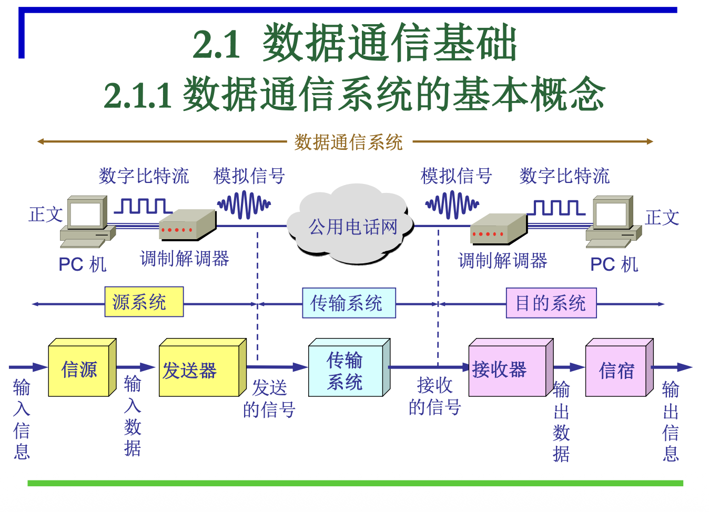

# 2.1.1 数据通信系统的基本概念

*   **本质问题**：计算机产生的数据如何在特定**介质**上（机械特性），以**何种方式**（电气特性），如何**有序**地（时序特性）传输到另一台计算机。
*   **物理层主要任务**：确定与传输媒体接口的四种特性：
    *   **机械特性**：接线器形状、尺寸、引线数目、排列、固定装置等。
    *   **电气特性**：接口电缆上各条线的电压范围。
    *   **功能特性**：某条线上特定电平电压所表示的意义。
    *   **过程特性**：不同功能事件出现的顺序。

#### 1. 数据通信系统组成

一个完整的数据通信系统通常包括**源系统**、**传输系统**和**目的系统**。

*   **源系统 (Source System)**：
    *   **信源**：产生要传输的数据（如PC机）。
    *   **发送器 (Transmitter)**：将数据转换为适合传输的信号（如调制解调器，将数字比特流转换为模拟信号）。
*   **传输系统 (Transmission System)**：
    *   负责信号的传输，可能是公用电话网、光纤、无线链路等。
*   **目的系统 (Destination System)**：
    *   **接收器 (Receiver)**：将接收到的信号转换回数据（如调制解调器，将模拟信号转换为数字比特流）。
    *   **信宿**：处理接收到的数据（如PC机）。

#### 2. 基本术语

*   **数据 (Data)**：信息的载体。
    *   **模拟数据**：连续变化（如语音、温度）。
    *   **数字数据**：离散变化（如文字、整数）。
*   **信息 (Information)**：数据的**内容/内涵**。
*   **信号 (Signal)**：数据的电气或电磁表现。
    *   **模拟信号**：连续变化的。
    *   **数字信号**：取值是离散数值的。
*   **信道 (Channel)**：用来表示向**某一个方向**传送信息的媒体。一条通信电路包含一条发送信道和一条接收信道。
    *   **数字信道**：采用数字信号传输数据。
    *   **模拟信道**：采用模拟信号传输数据。

#### 3. 基带信号与宽带信号

*   **基带信号 (Baseband Signal)**：
    *   **定义**：将数字信号 $0$ 或 $1$ **直接**用两种不同的电压来表示，然后送到线路上进行传输。
    *   **特点**：不经过调制，直接传输原始数字信号的频率成分。
*   **宽带信号 (Broadband Signal)**：
    *   **定义**：将基带信号进行**调制**后形成的**频分复用**模拟信号。
    *   **特点**：通过调制将不同基带信号的频谱搬移到不同的频段，使其在同一条电缆中同时传送多路数字信号，提高利用率，实现"一根线缆多路传输"。

### 易考点 & 难点

*   **易考点**：
    *   数据通信系统五大组成部分（信源、发送器、传输系统、接收器、信宿）。
    *   数据、信息、信号、信道的定义和区别。
    *   基带信号和宽带信号的定义及其传输方式的区别。
*   **难点**：理解基带与宽带信号在"频率范围"和"多路复用"上的本质差异。