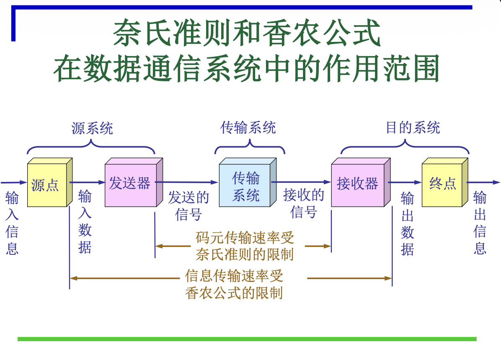

# 2.1.2 奈奎斯特定理与香农定理

本节讨论了数据传输速率的物理限制，通过奈奎斯特定理和香农定理揭示了理想信道和带噪声信道下的最高传输速率，是理解物理层性能上限的关键。

### 核心概念

#### 1. 数据通信系统的性能指标

*   **时延 (Delay)**：数据块从一端传送到另一端所需时间。
    *   **传输时延 (发送时间)**：$d_{trans} = \text{数据块长度} / \text{信息传输速率}$。指数据帧从发送端完全推送到传输介质所需的时间。
    *   **传播时延**：$d_{prop} = \text{信道长度} / \text{电磁波在信道上的传播速率}$。指电磁波在介质中传播的时间。
    *   **处理时延**：中间节点（如路由器）转发数据引起的时延。
    *   **排队时延**：分组在中间节点端口处等待传输的时间。
    *   **总时延**：$D_{total} = d_{trans} + d_{prop} + d_{proc} + d_{queue}$。

*   **时延带宽积 (Delay-Bandwidth Product)**：
    *   $P = \text{传播时延} \times \text{带宽 (比特/秒)}$。
    *   **物理意义**：链路能够容纳的比特数量。当发送端发送的第一个比特到达终点时，发送端已经发出了 $P$ 个比特，充满整个链路。
    *   **类比**：用圆柱形管道代表传输链路，管道长度是传播时延，截面积是带宽，体积就是时延带宽积。

*   **RTT (Round-Trip Time)**：
    *   **定义**：从发送端发送数据开始，到收到来自接收端的确认（接收端收到数据后立即发送确认）所需经历的总时延。
    *   通常包含两次传播时延和发送端、接收端的处理时延，以及中间节点的处理和排队时延。

*   **信号传输的"压迫"因素**：
    *   **时延 (Delay)**：信号传输的时间延迟。
    *   **衰减 (Attenuation)**：信号强度随距离减弱。
    *   **噪声 (Noise)**：信道中不希望存在的随机干扰。

*   **带宽 (Bandwidth)**：
    *   **频域称谓 (Hz)**：指在传输过程中，振幅不会明显减弱的频率范围。
    *   **时域称谓 (bps)**：指信道能达到的最高数据传输速率（比特/秒）。

*   **信息传输速率 (Information Transfer Rate)**：
    *   **定义**：每秒传输的**二进制比特数**，单位为比特/秒 (b/s 或 bps)，也称**比特率**。
    *   包括净荷（有效数据）和为控制传输所附加的信息。

*   **码元传输速率 (Baud Rate)**：
    *   **码元**：一个离散信号（电压）状态或信号事件。
    *   **定义**：每秒传输的**码元数**，单位为**波特 (Baud)**，也称**信号速率**、**调制速率**。
    *   **关系**：信息传输速率 $S$ 和码元传输速率 $B$ 的关系为 $S = B \times \log_2 V$ (b/s)，其中 $V$ 是一个码元所取得的有效离散值个数。
        *   若1个码元携带1 bit信息量，则 $S=B$。
        *   若1个码元携带 $n$ bit信息量，则 $S = B \times n$ b/s。

#### 2. 信道的最高码元传输速率：奈奎斯特定理 (Nyquist Theorem)

*   **前提**：**理想**、**无噪声**信道。
*   **定理**：理想信道的最高码元传输速率 $B_{max} = 2H$ Baud。
    *   $H$ 是理想信道的带宽（单位：赫兹 Hz）。
*   **奈氏定理表明**：
    *   任何信道中，码元传输速率有上限。超过此上限会产生**码间串扰 (ISI - Intersymbol Interference)**，使接收方无法识别。
    *   信道频带越宽，高频分量越多，能以更高速率传输码元而无码间串扰。
    *   实际信道的最高码元速率远低于奈氏准则。
*   **注意**：奈氏定理限制的是**码元传输速率**，与码元携带的比特数无关。

#### 3. 信道的极限信息传输速率：香农定理 (Shannon Theorem)

*   **前提**：**带宽受限**且有**高斯白噪声干扰**的信道。
*   **定理**：信道的极限信息传输速率 $C = W \log_2(1 + S/N)$ b/s。
    *   $C$ 为极限信息传输速率（b/s）。
    *   $W$ 为信道的带宽（Hz）。
    *   $S$ 为信道内所传信号的平均功率。
    *   $N$ 为信道内部高斯噪声功率。
    *   $S/N$ 为**信噪比**，常用分贝 (dB) 表示：信噪比(dB) $= 10 \log_{10}(S/N)$。
*   **香农公式表明**：
    *   带宽 $W$ 或信噪比 $S/N$ 越大，极限传输速率越高。
    *   只要信息传输速率低于 $C$，理论上就存在某种方法实现**无差错传输**。
    *   实际信道达到的速率远低于香农极限。
    *   对于已确定的信道，若带宽和信噪比不能提高，提高信息传输速率的方法是：**让每个码元携带更多比特的信息量**（即提高 $V$）。

#### 4. 奈氏准则和香农公式的作用范围

*   **奈氏准则**：限制**码元传输速率**（主要影响发送器和接收器之间的码元识别）。
*   **香农公式**：限制**信息传输速率**（信道能无差错传输的比特量）。

### 易考点 & 难点

*   **易考点**：
    *   时延（传输、传播、处理、排队）的计算和物理意义。
    *   时延带宽积的概念及物理意义。
    *   码元传输速率与信息传输速率的区别与联系 ($S = B \times \log_2 V$)。
    *   奈奎斯特定理和香农定理的公式、适用条件、物理含义和结论。
    *   信噪比的计算 ($dB$)。
    *   如何提高信息传输速率（增加带宽、提高信噪比、增加码元携带的比特数）。
*   **难点**：
    *   区分传输时延和传播时延，理解它们各自受什么因素影响。
    *   深入理解奈氏定理限制码元速率，香农定理限制信息速率的本质区别。
    *   奈氏定理和香农定理都是**理论上限**，实际应用中无法达到。