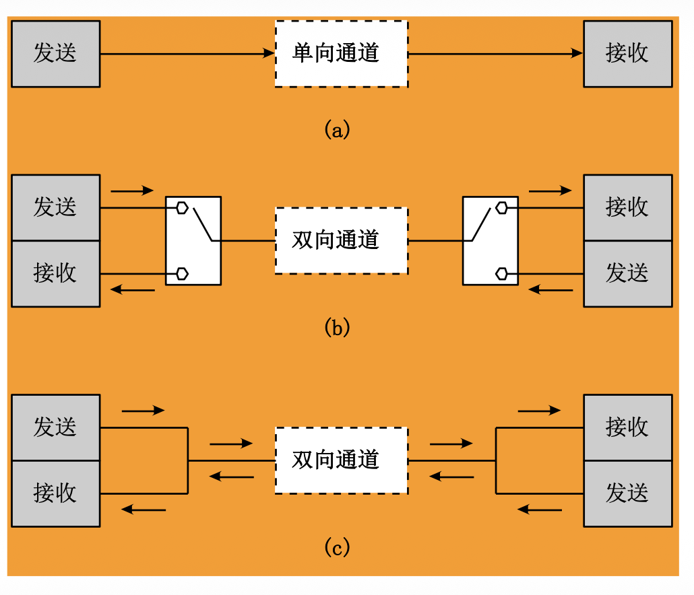

# 2.1.3 数据的传输方式

本节介绍了数据传输的基本方式，包括单工、半双工和全双工模式，以及串行和并行通信的特点。

### 核心概念

#### 1. 单工、全双工和半双工传输

*   **单工传输 (Simplex)**：
    *   **特点**：信息传输在**一个单一不变的方向**上进行。只有一个单向信道连接两个设备。
    *   **示例**：广播电台、传统收音机。
    *   **示意图**：`发送端 -->> 接收端`

*   **半双工传输 (Half-Duplex)**：
    *   **特点**：通信双方都可以发送和接收信息，但**不能同时进行**。在某一时刻，信道只能用于一个方向的传输。
    *   **示例**：对讲机（按键说话，松开收听）。
    *   **示意图**：`发送/接收端 <--> 接收/发送端` (非同时)

*   **全双工传输 (Full-Duplex)**：
    *   **特点**：通信双方可以**同时发送和接收信息**。两设备之间存在两条不同方向的信息传输通道。
    *   **示例**：电话通话、现代以太网。
    *   **示意图**：`发送/接收端 <==> 接收/发送端` (同时)

#### 2. 串行通信和并行通信
*   **串行通信 (Serial Communication)**：
    *   **特点**：数据比特**逐位依次**在单一信道上传输。
    *   **优点**：只需要少量传输线，成本低，适合长距离传输（避免同步问题）。
    *   **缺点**：传输速率相对较低。
    *   **示意图**：`b7-b6-b5-b4-b3-b2-b1-b0 -->> 接收端`

*   **并行通信 (Parallel Communication)**：
    *   **特点**：数据的多个比特（如一个字节的8位）**同时**在多条并行信道上传输。
    *   **优点**：传输速率高。
    *   **缺点**：需要多条传输线，成本高，易受串扰影响，适合短距离传输（如计算机内部总线）。
    *   **示意图**：`b7 -->> 接收端 b7`
                  `...`
                  `b0 -->> 接收端 b0`

### 易考点 & 难点

*   **易考点**：
    *   单工、半双工、全双工的区别及实际应用场景。
    *   串行通信和并行通信的优缺点及适用场景。
*   **难点**：理解全双工通信需要两条独立通道来实现同时收发。