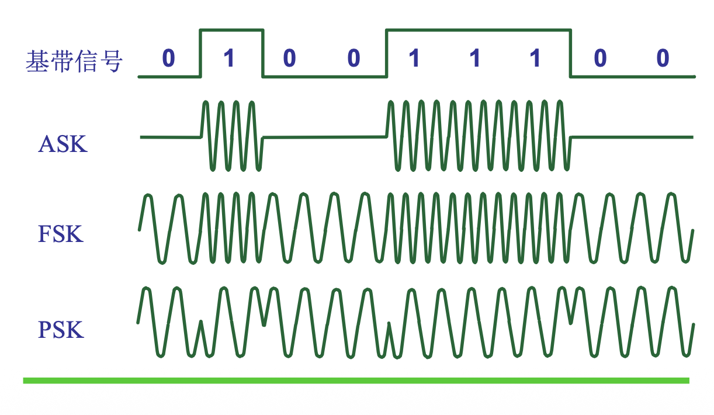

# 2.1.4 调制解调技术

本节主要研究数字数据在模拟信道中传输时所使用的技术，即调制与解调，以及调制解调器 (Modem) 的作用。

### 核心概念

#### 1. 调制解调器 (Modem)

*   **定义**：将数字信号转换为模拟信号（**调制**），以及将模拟信号转换回数字信号（**解调**）的设备。
*   **组成**：
    *   **调制器 (MOdulator)**：将要发送的**数字信号**转换为频率范围在特定范围（如电话用户线上的 $300 \sim 3400 \text{ Hz}$）的**模拟信号**。它是波形变换器。
    *   **解调器 (DEModulator)**：将电话用户线上传送来的**模拟信号**转换为**数字信号**。它是波形识别器。
*   **作用**：使数字数据能够在模拟信道（如电话线）上传输。

#### 2. 基本调制方法

最基本的二元制调制（用模拟信号的一个特性来表示数字信号的 $0$ 或 $1$）方法：

*   **调幅 (AM)**：
    *   **原理**：载波的**振幅**随基带数字信号（$0$ 或 $1$）而变化。
    *   **示例**：$0$ 对应低振幅， $1$ 对应高振幅。
*   **调频 (FM)**：
    *   **原理**：载波的**频率**随基带数字信号而变化。
    *   **示例**：$0$ 对应一个频率， $1$ 对应另一个频率。
*   **调相 (PM)**：
    *   **原理**：载波的**初始相位**随基带数字信号而变化。
    *   **示例**：$0$ 对应 $0^\circ$ 相位， $1$ 对应 $180^\circ$ 相位。

#### 3. 高级调制方法

*   **正交振幅调制 (QAM - Quadrature Amplitude Modulation)**：
    *   **原理**：结合了调幅和调相两种技术，通过改变载波的**振幅**和**相位**来表示更多离散状态。
    *   **优点**：每个码元可以携带更多比特的信息量，从而提高信息传输速率（如16QAM中，每个码元可表示4比特）。
    *   **缺点**：码元可表示的比特数越多，接收端解调时正确识别每种状态就越困难，对信噪比要求更高。
    *   **表示**：星座图（Constellation Diagram）上的每个点代表一种特定的振幅和相位组合，对应一个多比特编码。
        *   例：对于4比特编码（16种组合），QAM星座图有16个点。

### 易考点 & 难点

*   **易考点**：
    *   调制器和解调器的功能，以及调制解调器 (Modem) 的整体作用。
    *   ASK、FSK、PSK三种基本调制方法的原理。
    *   QAM的原理及其在提高信息传输速率上的作用。
*   **难点**：
    *   理解QAM如何通过振幅和相位组合来表示多比特信息。
    *   高阶调制（如QAM）在提高传输速率的同时，对信噪比和识别难度带来的挑战。