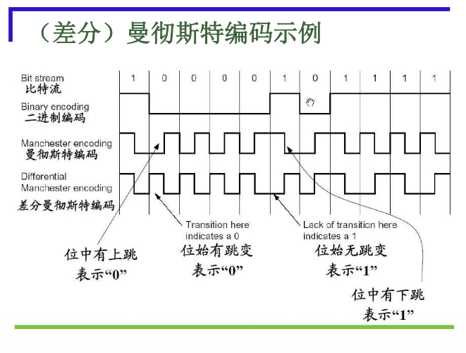

# 2.1.5 编码解码技术

本节聚焦于数字数据在数字传输系统（基带传输）中如何进行编码和解码，以确保数字信号的有效和可靠传输。

### 核心概念

#### 1. 数字数据的数字传输 (基带传输)

*   **原理**：将数字数据进行**线路编码**后再进行传输，接收端再**解码**还原原有数据。
*   **适用范围**：低速和高速的各种情况。
*   **限制**：基带信号所带的频率成分很宽，对传输线（带宽特性）有一定要求。
*   **流程**：`数字数据 -->> 编码器 -->> 数字信号 -->> 数字传输系统 -->> 解码器 -->> 数字数据`

#### 2. 常用的编码方式

*   **不归零制码 (NRZ - Non-Return to Zero)**：
    *   **原理**：用两种不同的电平（如高电平、低电平）分别表示二进制信息 $0$ 和 $1$。电平在位持续时间内保持不变。
    *   **缺点**：
        *   **难以分辨位边界**：当连续出现多个 $0$ 或 $1$ 时，接收方难以判断一位的结束和另一位的开始。
        *   **时钟同步问题**：发送方和接收方必须有精确的时钟同步机制，否则容易失步。
        *   **直流分量**：长时间的 $0$ 或 $1$ 会产生直流分量，对某些传输介质（如变压器耦合）不友好。
    *   **结论**：容易产生传播错误，不适用于长距离或异步传输。

*   **曼彻斯特码 (Manchester Code)**：
    *   **原理**：每一位中间都有一个**跳变**。
        *   从低电平跳到高电平表示 $0$。
        *   从高电平跳到低电平表示 $1$。
    *   **优点**：
        *   **自同步能力**：每一位中间的跳变既可作为数据，也可作为**时钟信号**，使得收发双方易于保持同步。
        *   **无直流分量**：每个位周期内正负电平各占一半，平均直流分量为零。
    *   **缺点**：
        *   **效率低**：每个比特需要两次电平跳变，因此所需的带宽是NRZ的两倍，时钟信号频率是发送信号频率的 $2$ 倍。
    *   **主要应用场合**：**Ethernet（以太网）**。

*   **差分曼彻斯特码 (Differential Manchester Code)**：
    *   **原理**：每一位中间都有一个跳变（用于时钟同步），但在**位开始时**的跳变表示数据。
        *   位开始时有跳变表示 $0$。
        *   位开始时无跳变表示 $1$。
    *   **优点**：
        *   **自同步能力**：同曼彻斯特码。
        *   **抗干扰性强**：基于电平跳变的有无，而不是绝对电平，对噪声的鲁棒性更好。
        *   **时钟、数据分离**：位中间跳变提供时钟，位前跳变提供数据。
    *   **缺点**：效率低，带宽要求高（同曼彻斯特码）。
    *   **主要应用场合**：**Token Ring（令牌环网）**。

#### 3. 曼彻斯特（及差分曼彻斯特）编码的特点总结

*   **自同步**：内含数据信息和时钟信息，易实现两种信息的合并与分离。
*   **无直流分量**。
*   **效率低**：时钟信号频率是发送信号频率的 $2$ 倍。
*   **违例码 (Violation Code)**：某些网络利用位中间不发生跳变的情况作为帧信息的开始和结束标志，例如**以太网的物理层帧前导码**中就利用了特殊的编码模式。

### 易考点 & 难点

*   **易考点**：
    *   NRZ、曼彻斯特码、差分曼彻斯特码的编码原理图示和核心区别。
    *   曼彻斯特码和差分曼彻斯特码的自同步特性和无直流分量优点。
    *   曼彻斯特码的效率问题和带宽要求。
    *   常见应用场景（以太网使用曼彻斯特码，令牌环网使用差分曼彻斯特码）。
*   **难点**：
    *   理解NRZ的同步问题和直流分量问题。
    *   区分曼彻斯特码和差分曼彻斯特码在"如何表示数据"上的细节差异（位中间跳变 vs 位开始跳变）。
    *   曼彻斯特编码效率低的根本原因（每比特两次电平变化）。