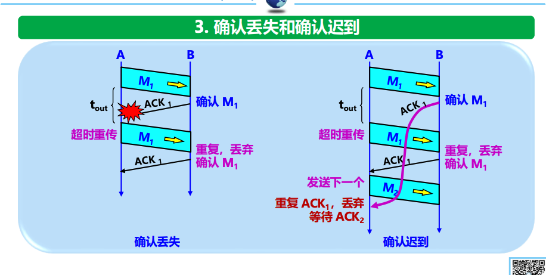
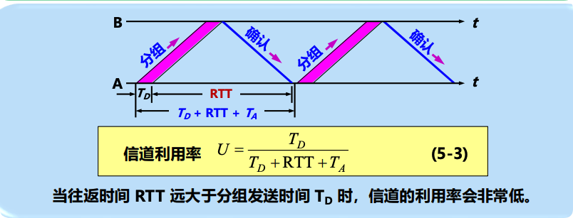
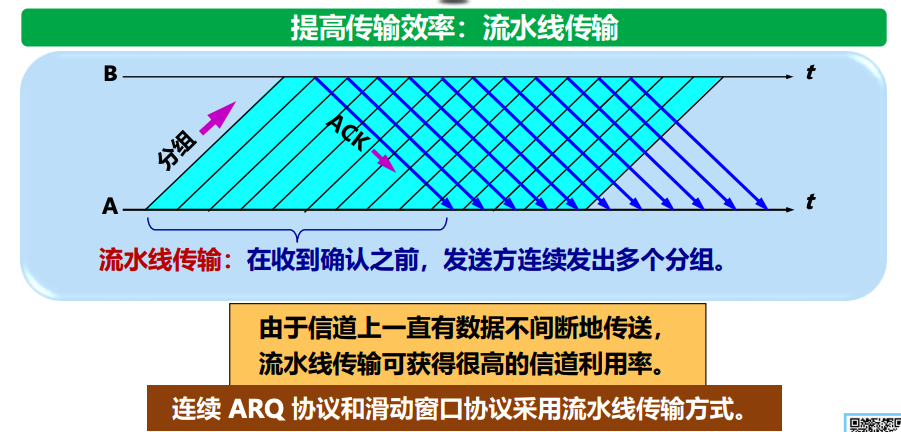

# 5.4.1 停止等待协议 (Stop-and-Wait Protocol)

这一节是**可靠传输**原理的入门。虽然现代 TCP 用的是更高级的"流水线传输（滑动窗口）"，但**停止等待协议**是所有可靠传输机制的**逻辑原点**。

考试中，这一节主要考察**"出了错怎么办？"**（即异常情况的处理流程），以及**信道利用率**的计算。

---

## 1. 核心概念：自动重传请求 (ARQ)

* **定义**：停止等待协议也被称为 **ARQ (Automatic Repeat reQuest)**。意思是：重传的请求是**自动**发出的（通过超时计时器），不需要接收方专门请求说"我没收到，请重传"。
* **基本规则**：
  - **"停止等待"**：发送方每发送完一个分组，就停止发送，等待接收方的确认 (ACK)。收到确认后，再发下一个。
  - **"全双工"**：虽然我们通常假设 A 发 B 收，但实际上双方都可以同时发送和接收。

---

## 2. 三种异常情况（★ 必考逻辑题）

考试最喜欢考：**"如果发生了某某丢包，协议怎么处理？"**

### (1) 情况一：数据分组丢失 / 出错

* **场景**：A 发送的数据 M1 在路上丢了，或者 B 收到 M1 检测出有错（丢弃）。
* **后果**：B 什么都不会做（不发 ACK，也不发 NAK）。
* **解决**：A 设置了一个**超时计时器 (Retransmission Timer)**。
  - 只要时间到了还没收到确认，A 就**默认**数据丢了，**自动重传** M1。
  - *考点*：**A 必须暂时保留已发送副本**，直到收到确认为止。

### (2) 情况二：确认丢失 (ACK Lost)

* **场景**：B 收到了 M1，发了 ACK1，但是 ACK1 在路上丢了。
* **后果**：A 超时后，重传 M1。
* **B 的应对（关键）**：
  1. B 又收到了 M1（重复分组）。
  2. B **丢弃** 重复的 M1。
  3. B **重传** ACK1（因为 A 显然没收到，还在傻等）。

### (3) 情况三：确认迟到 (ACK Delayed)

* **场景**：B 的 ACK1 没丢，但是网络太堵，晚点了。
* **后果**：A 超时重传 M1。B 收到重复 M1，丢弃并重发 ACK1。
* **A 的应对**：
  - A 后来陆续收到了两个 ACK1。
  - A 处理第一个，**丢弃** 第二个（重复的确认）。

---

## 3. 信道利用率 (计算题考点)

停止等待协议最大的缺点就是**效率低**。因为大部分时间都浪费在"等"ACK 回来。

### (1) 计算公式
   
信道利用率 $U$ 的公式如下（**★必背**）：

$$U = \frac{T_D}{T_D + RTT + T_A}$$

* **$T_D$**：发送时延（数据长度 / 带宽）。也就是你把数据推到链路上花的时间。
* **$RTT$**：往返时间（光在光纤里跑的时间 + 对方处理时间）。
* **$T_A$**：确认报文的发送时延（通常很小，有时可以忽略）。

### (2) 含义解析

* **分子**：你在干正事的时间（发数据）。
* **分母**：整个周期的时间（发数据 + 等 ACK 回来）。
* **结论**：当 **$RTT$ 非常大**时（比如卫星通信），利用率会**极低**。这就是为什么我们需要后来的流水线传输（滑动窗口）。

### (3) 计算示例

**例题**：假设发送时延 $T_D = 1ms$，往返时间 $RTT = 100ms$，确认发送时延 $T_A = 0.1ms$（可忽略），求信道利用率。

**解**：
$$U = \frac{1}{1 + 100 + 0.1} = \frac{1}{101.1} \approx 0.99\%$$

可以看到，利用率非常低！这就是为什么需要流水线传输。

---

## 4. 考试重点总结

### 考点一：为什么叫"可靠"？

因为它通过**超时重传**机制，保证了数据不丢失。

### 考点二：为什么要编号（0和1）？

* **分组编号**：为了让 B 知道这是新数据还是重传的旧数据（防止重复接收）。
* **ACK 编号**：为了让 A 知道 B 到底确认的是哪一个分组（防止确认混淆）。

### 考点三：超时时间怎么定？

必须 **大于** 平均往返时间 (RTT)。太短会频繁误重传，太长会效率低下。

### 考点四：流水线传输的引出

如果题目问"如何提高信道利用率？"，答案是：**采用流水线传输（连续 ARQ 协议）**。

### 考点五：异常情况处理（逻辑题）

* **数据丢失**：超时重传
* **ACK丢失**：接收方丢弃重复分组，重传ACK
* **ACK迟到**：发送方丢弃重复的ACK

---

## 🎓 易错点提醒

1. **不要混淆**：停止等待协议中，ACK 的编号是**下一个期望收到的序号**，不是当前收到的序号。
   - 例如：收到 M0，发送 ACK1（表示期望收到 M1）

2. **重传机制**：发送方必须**保留已发送分组的副本**，直到收到确认为止。

3. **效率问题**：停止等待协议虽然可靠，但效率极低，不适合高速网络。

