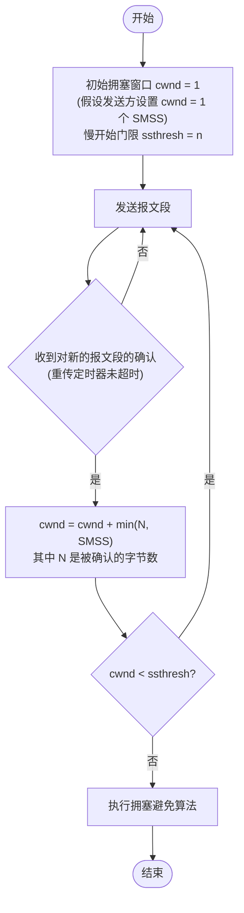

# 5.8.2 TCP 的拥塞控制方法

这一节是第五章的**终极BOSS**。
它不仅是**选择题**的必考点，更是**综合分析题（画图/计算）**的重灾区。考试经常会给你一个场景（比如"第 x 轮发生了超时"），让你画出拥塞窗口的变化曲线。

你必须死死记住 **4 个核心算法** 和 **2 个关键变量**。

---

## 🟢 [交互演示]：拥塞控制曲线生成器

这个演示能帮你搞定**"画图题"**。

<TCPCongestionAlgorithm />

**操作说明**：
1. 点击"下一轮 (正常传输)"，观察曲线如何增长
2. **关键测试**：
   - 让它增长过门限，观察从指数变线性
   - 点击 **"发生超时"**，看它如何跌落谷底
   - 点击 **"收到3个重复ACK"**，看它如何半山腰减半（快恢复）

---

## 📚 核心考点笔记

### 1. 两个核心变量 (★ 必背)

发送方维持一个叫做 **拥塞窗口 `cwnd` (Congestion Window)** 的状态变量。

* **`cwnd`**：取决于网络的拥塞程度，动态变化。
* **`rwnd`**：接收方通知的接收窗口（流量控制）。
* **真正的发送窗口**：
  $$发送窗口上限 = \min [ rwnd, cwnd ]$$
  *(考试通常假设 rwnd 很大，所以发送窗口就看 cwnd)*

* **`ssthresh` (慢开始门限)**：一个状态标记。
  * 当 `cwnd < ssthresh`：使用 **慢开始** 算法。
  * 当 `cwnd > ssthresh`：使用 **拥塞避免** 算法。

### 2. 四大算法详解 (★ 大题核心)

#### (1) 慢开始 (Slow Start)

* **名字误区**：它一点都不慢！它其实是**指数增长**。
* **核心规则**：
  * 起始 `cwnd = 1`。
  * 每经过一个传输轮次 (RTT)，`cwnd` **加倍** (1, 2, 4, 8, 16...)。
* **目的**：快速探测网络带宽，直到碰到门限 `ssthresh`。

:::details 📖 详细说明（点击展开）

* **初始设置**：
  * 起始 `cwnd = 1`（假设发送方设置 cwnd = 1 个 SMSS）。
  * 慢开始门限 `ssthresh = n`（初始值由系统设定）。
* **拥塞窗口增加规则**：
  * 在每收到一个对新的报文段的确认，就把拥塞窗口增加最多一个发送方的最大报文段 SMSS (Sender Maximum Segment Size) 的数值。
  * **公式**：
    $$拥塞窗口 cwnd 每次的增加量 = \min (N, SMSS)$$
    其中 $N$ 是原先未被确认的、但现在被刚收到的确认报文段所确认的字节数。
* **简化理解**：
  * 每经过一个传输轮次 (RTT)，`cwnd` **加倍** (1, 2, 4, 8, 16...)。
  * 这是因为在一个 RTT 内，可以发送 cwnd 个报文段，收到确认后 cwnd 增加 cwnd，相当于翻倍。

##### 慢开始算法流程图



**流程说明**：
1. **初始化**：设置 `cwnd = 1`，`ssthresh = n`。
2. **发送报文段**：根据当前 cwnd 发送数据。
3. **收到确认**：每收到一个对新的报文段的确认（重传定时器未超时），更新 cwnd。
4. **判断**：如果 `cwnd < ssthresh`，继续慢开始；否则进入拥塞避免。

:::

#### (2) 拥塞避免 (Congestion Avoidance)

* **触发条件**：当 $cwnd \geq ssthresh$ 时，进入拥塞避免阶段。
* **规则**：每经过一个 RTT，拥塞窗口线性增加。
* **公式**：
  $$cwnd = cwnd + 1 \quad \text{(每 RTT)}$$
* **特征**：**线性增长**（加法增大 AI - Additive Increase）。

#### (3) 快重传 (Fast Retransmit)

* **触发条件**：收到 **3 个重复的 ACK**（说明中间丢了一个包，但网络没断）。
* **动作**：立即重传丢失的包，**不要等超时计时器**。
* **目的**：快速恢复，避免等待超时。

#### (4) 快恢复 (Fast Recovery)

* **配合快重传使用**。既然能收到 3 个重复 ACK，说明网络虽然堵，但还没死锁。
* **动作**（乘法减小 MD）：
  $$ssthresh = \max(2, \lfloor cwnd / 2 \rfloor)$$
  $$cwnd = ssthresh$$
  然后直接进入 **拥塞避免**（线性增长），**跳过慢开始**。
* **注意**：有些实现版本使用 $cwnd = ssthresh + 3$，考试时按题目要求或教材标准（通常是 $cwnd = ssthresh$）。

#### (5) 超时处理 (Timeout Handling) ★

**重要**：无论在慢开始阶段还是在拥塞避免阶段，只要发送方判断网络出现拥塞（**重传定时器超时**），都要执行以下操作：

1. **更新慢开始门限**：
   $$ssthresh = \max(2, \lfloor cwnd / 2 \rfloor)$$

2. **重置拥塞窗口**：
   $$cwnd = 1$$

3. **执行慢开始算法**：重新从慢开始阶段开始。

**目的**：迅速减少主机发送到网络中的分组数，使得发生拥塞的路由器有足够时间把队列中积压的分组处理完毕。

**注意**：
- 超时说明网络**严重拥塞**，连 ACK 都传不回来了。
- 与快恢复的区别：超时后 $cwnd = 1$（回到起点），而快恢复后 $cwnd = ssthresh$（半山腰）。

---

## 🎓 考试必背考点

### 1. 两张图的区别 (AIMD)

* **乘法减小 (MD)**：一出问题（超时或3 ACK），`ssthresh` 和 `cwnd` 都要减小。
* **加法增大 (AI)**：进入拥塞避免后，慢慢 `+1`。
* **目的**：为了迅速腾出网络资源，但只敢小心翼翼地增加负荷。
* **记忆**：**AIMD = Additive Increase, Multiplicative Decrease**

### 2. "超时" vs "3个重复ACK" (考点：处理方式不同)

#### 超时 (Timeout)

* **说明**：网络**严重拥塞**，连 ACK 都传不回来了。
* **策略**：**严厉**。
  $$ssthresh = \max(2, \lfloor cwnd / 2 \rfloor)$$
  $$cwnd = 1$$
  重新从慢开始阶段开始。

#### 3个重复ACK

* **说明**：网络**轻度拥塞**（包丢了，但后续的包到了，说明路还能走）。
* **策略**：**温和**。
  $$ssthresh = \max(2, \lfloor cwnd / 2 \rfloor)$$
  $$cwnd = ssthresh$$
  直接进入拥塞避免（线性增长），**跳过慢开始**。

### 3. 常见计算题套路

**题目**：TCP 拥塞窗口 $cwnd=24$，$ssthresh=16$。

#### 情况1：若发生了超时

$$ssthresh = \max(2, \lfloor 24 / 2 \rfloor) = 12$$
$$cwnd = 1$$
下一轮进入**慢开始**（指数增长）。

#### 情况2：若收到了 3 个重复 ACK

$$ssthresh = \max(2, \lfloor 24 / 2 \rfloor) = 12$$
$$cwnd = ssthresh = 12$$
下一轮进入**拥塞避免** (线性增长)。

### 4. 算法切换规则

| 条件 | 算法 | cwnd 变化 | ssthresh 变化 |
| :--- | :--- | :--- | :--- |
| $cwnd < ssthresh$ | 慢开始 | $cwnd = cwnd \times 2$ | 不变 |
| $cwnd \geq ssthresh$ | 拥塞避免 | $cwnd = cwnd + 1$ | 不变 |
| 发生超时 | 慢开始 | $cwnd = 1$ | $ssthresh = \max(2, \lfloor cwnd/2 \rfloor)$ |
| 收到3个重复ACK | 拥塞避免 | $cwnd = ssthresh$ | $ssthresh = \max(2, \lfloor cwnd/2 \rfloor)$ |

---

## 🎯 易错点提醒

1. **慢开始不慢**：
   - 慢开始是**指数增长**，速度很快
   - 名字容易误导，要记住是"慢开始"但增长快

2. **超时 vs 3个重复ACK**：
   - 超时：$cwnd = 1$，重新慢开始
   - 3个重复ACK：$cwnd = ssthresh$，直接拥塞避免

3. **ssthresh 的更新**：
   - 超时或3个重复ACK时，ssthresh 都要减半
   - 公式：$ssthresh = \max(2, \lfloor cwnd/2 \rfloor)$
   - 注意：最小值是 2，不能小于 2

4. **发送窗口的计算**：
   - 发送窗口 = $\min(rwnd, cwnd)$
   - 考试通常假设 rwnd 很大，所以只看 cwnd

5. **快恢复的 cwnd 值**：
   - 标准版本：$cwnd = ssthresh$
   - 有些实现：$cwnd = ssthresh + 3$
   - 考试时按题目要求或教材标准（通常是 $cwnd = ssthresh$）

---

## 📊 典型曲线图

拥塞窗口的变化曲线通常呈现**锯齿状**：

```
cwnd
  ↑
  |     ╱╲
  |    ╱  ╲
  |   ╱    ╲╱╲
  |  ╱        ╲
  | ╱          ╲╱
  |╱            ╲
  └──────────────→ 轮次
  慢开始  拥塞避免
```

**特点**：
- 慢开始阶段：指数增长（陡峭上升）
- 拥塞避免阶段：线性增长（缓慢上升）
- 发生拥塞：突然下降（超时或快恢复）
- 重复循环：形成锯齿状曲线

---

## 总结

这一节的核心就是**"乘法减小，加法增大"**。

**核心要点**：
1. **两个变量**：cwnd（拥塞窗口）和 ssthresh（慢开始门限）
2. **四个算法**：慢开始、拥塞避免、快重传、快恢复
3. **两种拥塞**：超时（严重）和3个重复ACK（轻度）
4. **AIMD**：加法增大，乘法减小

只要你能把演示里那条**锯齿状的曲线**印在脑子里，无论考试给你什么数字，套用规则（翻倍、加一、归一、减半）去算准没错！

