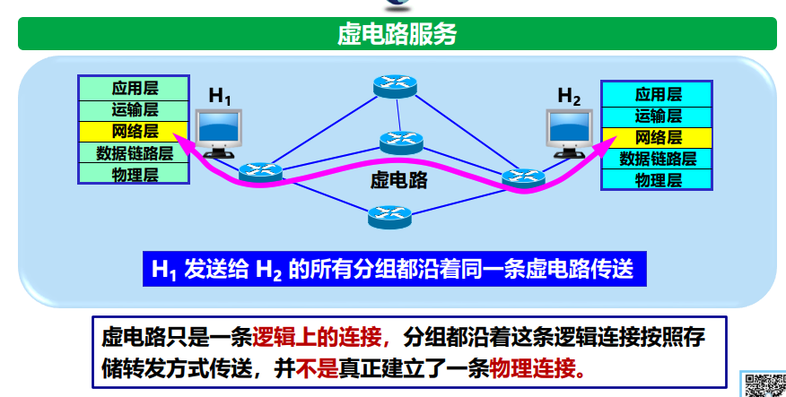
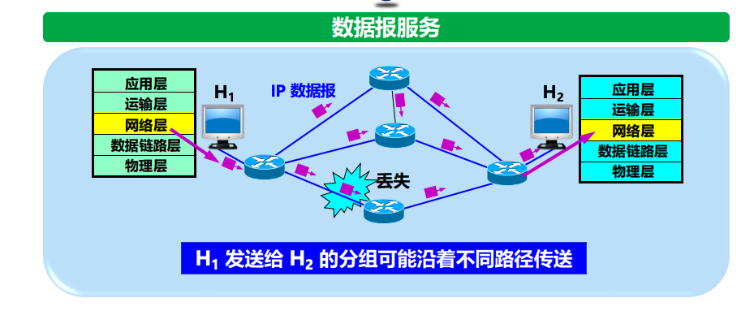

# 4.1.1 网络层提供的两种服务

在计算机网络发展初期，关于网络层应该提供"面向连接"还是"无连接"的服务存在很大争议。互联网（Internet）最终采用了**数据报服务**的设计思路。

## 1. 虚电路服务 (Virtual Circuit Service) - 电信网的思路

- **核心思想**：让**网络**负责可靠交付。
- **工作方式**：通信前必须先建立连接（虚电路），通信过程需预留资源，所有分组沿着同一条逻辑连接传送。
- **缺点**：路由器复杂，难以适应网络拥塞和节点故障（灵活性差）。

## 2. 数据报服务 (Datagram Service) - 互联网的思路 ⭐ **重点**

- **核心思想**：网络层设计得尽量**简单**，向其上层提供**无连接的**、**尽最大努力交付**的数据报服务。
- **可靠性原则**：**网络层不提供服务质量承诺**（可能出错、丢失、乱序），可靠通信由**主机中的运输层**（如TCP）负责。
- **特点**：
  - **无连接**：发送分组前不需要建立连接。
  - **独立性**：每个分组（IP数据报）独立发送，前后分组无关。
  - **路由**：每个分组独立选择路由，可能经过不同路径到达终点。

## 3. 虚电路与数据报的对比 ⭐ **考点总结**

| 对比方面 | 虚电路服务 | **数据报服务** (Internet采用) |
| :--- | :--- | :--- |
| **思路** | 可靠通信由**网络**保证 | 可靠通信由**用户主机**保证 |
| **连接的建立** | 必须有 | **不需要** |
| **终点地址** | 仅连接建立阶段使用，后续用虚电路号 | 每个分组都有**终点的完整地址** |
| **分组转发** | 沿同一条虚电路转发 | 每个分组**独立选择路由**转发 |
| **当结点出故障** | 所有经过该结点的虚电路均断开 | 出故障的结点可能会丢失分组，但可自动绕开故障路由 |
| **分组顺序** | 按序到达 | **不一定按序到达** |

