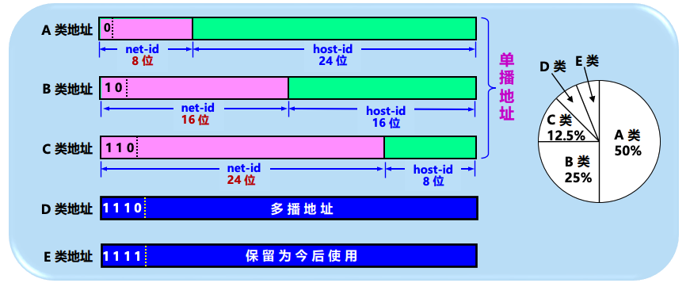

# 4.2.2 IP地址 ⭐ **重点：分类与CIDR**

IP地址是互联网上每一台主机（或路由器）的每一个接口的唯一标识。IPv4地址长度为 **32位**，通常用点分十进制表示（如 `192.168.1.1`）。

## IP 地址的特点

### (1) 每个 IP 地址都由网络前缀和主机号两部分组成

- IP地址采用**分等级的地址结构**
- 由**网络前缀**和**主机号**两部分组成
- **优点**：
  - 方便了 IP 地址的分配和管理
  - 实现路由聚合，减小了转发表所占的存储空间，以及查找转发表的时间

### (2) IP 地址是标志一台主机（或路由器）和一条链路的接口

- **多归属主机 (multihomed host)**：
  - 当一台主机同时连接到两个网络上时，该主机就必须同时具有两个相应的 IP 地址
  - 其网络号必须是不同的
- **路由器**：
  - 一个路由器至少应当连接到两个网络
  - 因此一个路由器至少应当有两个不同的 IP 地址
  - **重要**：路由器的每一个接口都有一个**不同网络号**的 IP 地址

### (3) 转发器或交换机连接起来的若干个局域网仍为一个网络

- **按照互联网的观点**：一个网络（或子网）是指具有相同网络前缀的主机的集合
- **关键规则**：同一个局域网上的主机或路由器的 IP 地址中的**网络号必须一样**
- 转发器或交换机连接起来的若干个局域网都具有同样的网络号，它们仍为一个网络
- **具有不同网络号的局域网必须使用路由器进行互连**

#### ⚠️ 路由器接口的特殊情况：点对点链路

- **两个路由器直接相连的接口处**：
  - 可指明也可不指明 IP 地址
  - 如指明 IP 地址，则这一段连线就构成了一种只包含一段线路的特殊"网络"
  - 这种网络仅需两个 IP 地址，可以使用 **/31 地址块**
  - 主机号可以是 0 或 1（不需要网络地址和广播地址）

### (4) 在 IP 地址中，所有分配到网络前缀的网络都是平等的

- 互联网同等对待每一个 IP 地址
- 不管是范围很小的局域网，还是可能覆盖很大地理范围的广域网

---

## 1. 分类的IP地址 (两级结构)

由 **{网络号, 主机号}** 组成。

| 类别 | 前导位 | 网络号范围 (net-id) | 网络号长度 | 主机号长度 | 适用场景 |
| :--- | :--- | :--- | :--- | :--- | :--- |
| **A 类** | **0** | 1 ~ 126 | 1字节 (8位) | 3字节 (24位) | 超大规模网络 |
| **B 类** | **10** | 128 ~ 191 | 2字节 (16位) | 2字节 (16位) | 中等规模网络 |
| **C 类** | **110** | 192 ~ 223 | 3字节 (24位) | 1字节 (8位) | 小规模网络 |
| **D 类** | **1110** | 224 ~ 239 | 多播地址 (Multicast) | - | 多播/组播 |
| **E 类** | **1111** | 240 ~ 255 | 保留 | - | 科研 |



### 特殊IP地址 ⭐ **考点**

- **主机号全0**：代表网络本身（网络地址）。
- **主机号全1**：本网络的广播地址。
- **127.x.x.x**：环回地址（Loopback），用于本机测试（如 `127.0.0.1`）。
- **0.0.0.0**：本网范围内"本主机"的源地址（启动时使用）。
- **255.255.255.255**：受限广播地址（本网广播）。

## 2. 无分类编址 CIDR (Classless Inter-Domain Routing) ⭐ **重点**

消除了A/B/C类的概念，可以更有效地分配IP地址。

- **记法**：**斜线记法** (a.b.c.d**/n**)。`/n` 表示**网络前缀**所占的比特数。
  - 例：`128.14.35.7/20`，前20位是网络前缀，后12位(32-20)是主机号。
- **地址掩码 (子网掩码)**：32位，由一串1和一串0组成。1的个数等于网络前缀长度。
  - **网络地址计算公式**：`IP地址` AND `子网掩码` = `网络地址`。
- **地址块 (构造超网)**：CIDR将网络前缀相同的连续IP组成一个"CIDR地址块"。
  - **路由聚合 (Route Aggregation)**：路由器在路由表中，将多个小的子网聚合成一个大的地址块（超网），以减小路由表规模。

### ⚠️ 重要概念：IP地址 vs 地址块

**示例说明**：

- `128.14.35.7/20` 是 **IP 地址**，同时指明了网络前缀为 20 位。
- 该地址是 `128.14.32.0/20` **地址块**中的一个地址。
- `128.14.32.0/20` 是包含有多个 IP 地址的**地址块**，同时也是这个地址块中**主机号为全 0 的 IP 地址**（即网络地址）。

📌 **关键理解**：
- **IP地址**：指代一个具体的地址（如 `128.14.35.7/20`）
- **地址块**：指代一个网络前缀相同的地址集合（如 `128.14.32.0/20`）
- **网络地址**：地址块中主机号全0的地址，代表整个网络（如 `128.14.32.0/20`）

### 三个特殊的 CIDR 地址块 ⭐ **考点**

| 网络前缀长度 | 点分十进制 | 说明 |
| :--- | :--- | :--- |
| **/32** | 255.255.255.255 | 就是一个 IP 地址。这个特殊地址用于**主机路由** |
| **/31** | 255.255.255.254 | 只有两个 IP 地址，其主机号分别为 0 和 1。这个地址块用于**点对点链路** |
| **/0** | 0.0.0.0 | 同时 IP 地址也是全 0，即 `0.0.0.0/0`。用于**默认路由** |

📌 **重要说明**：
- **/32**：掩码全1，表示精确匹配一个IP地址，用于特定主机路由（优先级最高）
- **/31**：只有2个地址（主机号0和1），通常用于点对点链路，不需要网络地址和广播地址
- **/0**：掩码全0，匹配所有IP地址，用于默认路由（优先级最低）

### CIDR计算题 ⭐⭐⭐ **综合题核心考点**

给定一个IP地址和掩码（如 `128.14.35.7/20`），必须能迅速计算出：

1. **网络地址**（AND运算）：
   - `IP地址` AND `子网掩码` = `网络地址`
   - 例：`128.14.35.7` AND `255.255.240.0` = `128.14.32.0`

2. **广播地址**（主机号全1）：
   - 将主机号部分全部置1
   - 例：网络地址 `128.14.32.0/20`，广播地址为 `128.14.47.255`
   
   **二进制计算过程**（以 `128.14.32.0/20` 为例）：
   ```
   网络地址：128.14.32.0/20
   二进制：  10000000 00001110 00100000 00000000
            └──────────┬──────────┘└─────┬─────┘
              前20位（网络前缀）    主机号，全0
   
   广播地址：将主机号部分全部置1
   二进制：  10000000 00001110 00101111 11111111
            └──────────┬──────────┘└─────┬─────┘
              前20位（保持不变）  主机号，全部置1
   
   转换为十进制：
   128.14.47.255
   ```

3. **地址范围**（最小IP到最大IP）：
   - 最小IP = 网络地址 + 1（主机号全0不可用）
   - 最大IP = 广播地址 - 1（主机号全1不可用）
   - 例：`128.14.32.1` 到 `128.14.47.254`
   
   **二进制计算过程**：
   ```
   最小IP（网络地址 + 1）：
   网络地址：10000000 00001110 00100000 00000000 (128.14.32.0)
   +1：      10000000 00001110 00100000 00000001 (128.14.32.1)
   
   最大IP（广播地址 - 1）：
   广播地址：10000000 00001110 00101111 11111111 (128.14.47.255)
   -1：      10000000 00001110 00101111 11111110 (128.14.47.254)
   ```

4. **主机数量**：
   - 公式：$2^{主机号位数} - 2$（减去全0和全1）⚠️ **易错点**
   - 例：`/20` 表示主机号有 32-20=12 位，主机数量 = $2^{12} - 2 = 4094$
   - **注意**："全0"和"全1"的主机号通常不可用，计算最大可分配地址时要减2

5. **路由聚合（构造超网）**：
   - 给定多个小网段（如多个 `/24` 的地址），找出它们的**共同前缀**，合并成一个大的路由条目
   - 方法：找出所有地址的公共前缀位，确定最长公共前缀长度

