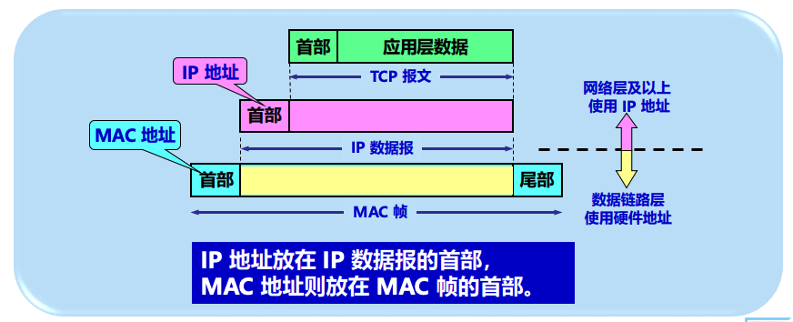
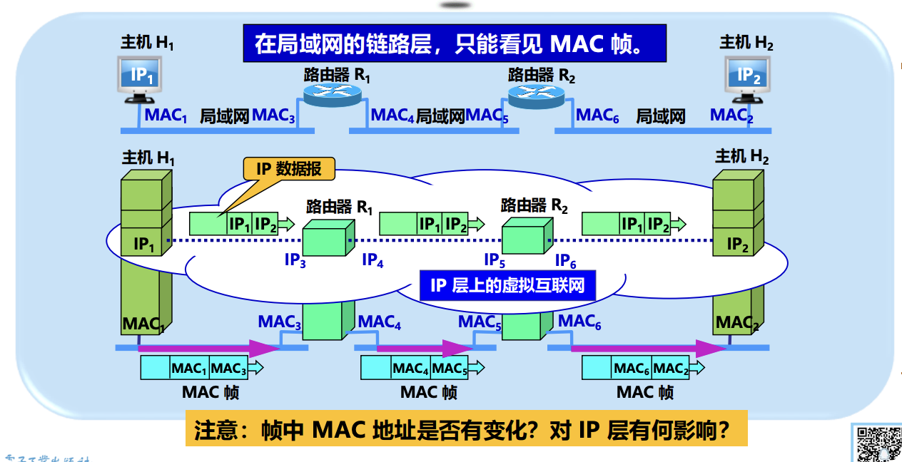

# 4.2.3 IP地址与 MAC地址

## 核心概念

- **IP 地址**：网络层地址，用于唯一标识互联网上的主机或路由器。
  - 放在 **IP数据报** 的首部
  - 网络层及以上使用
  - 在互联网传输过程中，**源IP和目的IP通常保持不变**（NAT除外）
- **MAC 地址**：数据链路层地址，用于局域网内部唯一标识网络接口。
  - 放在 **MAC帧** 的首部
  - 数据链路层使用
  - 在传输过程中，**每一跳都会改变**（源MAC变为当前路由器出口MAC，目的MAC变为下一跳路由器的MAC）

---

## 两者的关系

- 在同一个局域网中，主机发送IP数据报前，需要先知道目的主机的MAC地址。
- IP通信依赖MAC地址进行实际的数据帧传输。
- IP地址与MAC地址的映射通过**地址解析协议（ARP）**实现。

### 地址变化规律 ⭐ **考点**

| 地址类型 | 变化情况 | 说明 |
| :--- | :--- | :--- |
| **IP地址** | **端到端不变** | 源IP和目的IP在整个传输过程中基本保持不变（NAT除外） |
| **MAC地址** | **逐跳改变** | 每一跳都要重新封装，源MAC和目的MAC都会改变 |

**记忆要点**：
- IP地址是**端到端**的，在传输过程中基本不变
- MAC地址是**逐跳**的，每一跳都要重新封装

---

## 使用场景

### 1. 本地网络通信

- 主机发送数据到同一局域网的其他主机，需要用ARP解析IP对应的MAC地址。
- **ARP解析对象**：直接解析**目的主机**的MAC地址

### 2. 跨网络通信

- 主机发送数据到其他网络时，先找到本地路由器的MAC地址，然后由路由器转发数据。
- **ARP解析对象**：解析**本网络上的默认网关（路由器接口）**的MAC地址
- 剩下的工作由路由器完成（路由器会继续转发到下一跳）

---

## IP与MAC协作的意义

- **IP地址**简化了跨网络通信复杂性
- **MAC地址**用于局域网内部寻址，**IP地址**用于跨网络寻址
- 用户和应用层无需关心MAC地址的获取，ARP由系统自动处理

---

## 典型场景分析 ⭐ **综合题考点**

### 场景1：主机A通过路由器R发送数据给主机B

**地址变化过程**：

1. **从A到R（第一跳）**：
   - IP地址：源IP = A的IP，目的IP = B的IP（**不变**）
   - MAC地址：源MAC = A的MAC，目的MAC = R接口的MAC（**改变**）
   - ARP解析：A解析**路由器R接口**的MAC地址

2. **从R到B（第二跳）**：
   - IP地址：源IP = A的IP，目的IP = B的IP（**仍然不变**）
   - MAC地址：源MAC = R出口接口的MAC，目的MAC = B的MAC（**再次改变**）
   - ARP解析：R解析**目的主机B**的MAC地址

---

### 场景2：主机H1通过路由器R1和R2发送数据给主机H2 ⭐ **详细示例**

**通信路径**：`H1 → R1 → R2 → H2`

**地址变化过程**：

#### 第一跳：H1 → R1
- **IP数据报**：
  - 源IP = IP1（H1的IP地址）
  - 目的IP = IP2（H2的IP地址）
- **MAC帧**：
  - 源MAC = MAC1（H1的MAC地址）
  - 目的MAC = MAC3（R1接口的MAC地址）
- **说明**：H1需要先通过ARP解析R1接口的MAC地址（MAC3）

#### 第二跳：R1 → R2
- **IP数据报**：
  - 源IP = IP1（**保持不变**）
  - 目的IP = IP2（**保持不变**）
- **MAC帧**：
  - 源MAC = MAC4（R1出口接口的MAC地址，**已改变**）
  - 目的MAC = MAC5（R2接口的MAC地址，**已改变**）
- **说明**：R1接收后解封IP数据报，重新封装成MAC帧，通过ARP解析R2接口的MAC地址（MAC5）

#### 第三跳：R2 → H2
- **IP数据报**：
  - 源IP = IP1（**仍然保持不变**）
  - 目的IP = IP2（**仍然保持不变**）
- **MAC帧**：
  - 源MAC = MAC6（R2出口接口的MAC地址，**再次改变**）
  - 目的MAC = MAC2（H2的MAC地址，**再次改变**）
- **说明**：R2接收后解封IP数据报，重新封装成MAC帧，通过ARP解析H2的MAC地址（MAC2）

---

### 📊 地址变化总结表

| 跳数 | 路径 | IP地址 | MAC地址 | 说明 |
| :--- | :--- | :--- | :--- | :--- |
| 1 | H1 → R1 | 源IP=IP1 目的IP=IP2 | 源MAC=MAC1 目的MAC=MAC3 | IP地址不变，MAC地址改变 |
| 2 | R1 → R2 | 源IP=IP1 目的IP=IP2 | 源MAC=MAC4 目的MAC=MAC5 | IP地址仍然不变，MAC地址再次改变 |
| 3 | R2 → H2 | 源IP=IP1 目的IP=IP2 | 源MAC=MAC6 目的MAC=MAC2 | IP地址始终不变，MAC地址第三次改变 |

---

### 💡 关键理解

#### 从协议栈的角度看：

1. **网络层（IP层）**：
   - 看到的是整个虚拟互联网
   - IP地址从H1的IP1到H2的IP2，**在整个路径上保持不变**
   - 路由器只根据目的IP地址决定下一跳

2. **数据链路层（MAC层）**：
   - 看到的是局域网之间的帧传输
   - 每段链路都有自己的源MAC和目的MAC
   - **每经过一个局域网，MAC地址都会更新**

#### 设计优势：

- **IP地址不变**（逻辑地址）：实现端到端的逻辑连接，网络层只关心"谁是最终目标"
- **MAC地址改变**（物理地址）：实现物理链路上的实际传输，链路层解决"如何在这一段链路上传输"
- 这种设计使得**网络层只关心逻辑通信，而物理传输由链路层解决**

#### 记忆口诀：

> **IP地址端到端，MAC地址逐跳变**
> **网络层看逻辑，链路层管物理**
