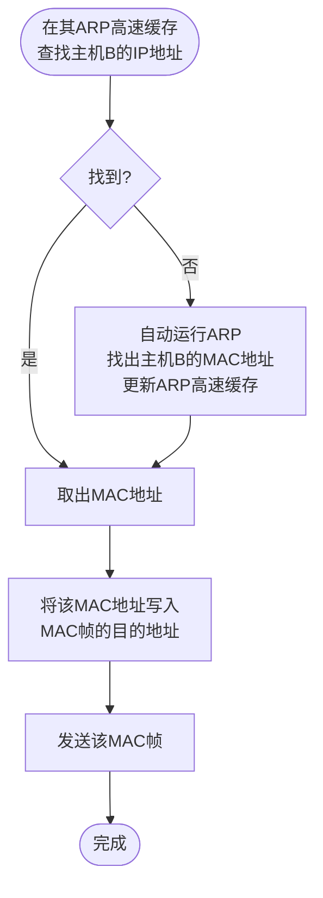

# 4.2.4 地址解析协议 ARP

## 一、核心背景：为什么要用 ARP？

### 在 IP 通信中同时使用两种地址

- **IP 地址**：
  - 网络层地址
  - 用来标识**"通信的终点是谁"**（逻辑地址）
  - 统一、抽象的逻辑地址
- **MAC 地址**：
  - 数据链路层地址
  - 用来标识**"下一跳帧往哪块网卡送"**（物理地址）
  - 复杂、多样的硬件地址

### 📌 核心问题

> **已知对方 IP 地址，如何得到对应的 MAC 地址？**

👉 **解决方案：ARP（地址解析协议）**

### ARP 的作用

**ARP（Address Resolution Protocol）作用：**

> **从 IP 地址解析出 MAC 地址**

即：

```
IP 地址  ——ARP——>  MAC 地址
```

- ARP 是 **IP 协议的配套协议**，为 IP 数据报的发送服务
- **屏蔽细节**：IP 层通过 ARP 协议屏蔽了下层物理网络的复杂性，使通信研究可以简化为"主机与主机/路由器"之间的逻辑对话

⚠️ **注意**：ARP 分组封装在**以太网帧**中，而不是封装在 IP 数据报中。

### ARP 属于哪一层？

- **ARP 为网络层服务**
- 但：
  - **ARP 报文直接封装在 MAC 帧中**
  - 不经过 IP 层转发

📌 **常见考试表述**：

> ARP 是网络层的辅助协议，但工作在数据链路层之上

---

## 二、核心数据结构：ARP 高速缓存 (ARP Cache) ⭐⭐⭐

这是 ARP 能够高效运行的关键，即"映射表/跳转基础表"。

每台主机/路由器都维护一个 **ARP 高速缓存表**：

### ARP 高速缓存表的内容

| IP 地址 | MAC 地址 | 生存时间 (Age) | 类型 (Type) |
| :--- | :--- | :--- | :--- |
| 10.4.9.2 | 0030.7131.abfc | 00:08:55 | Dynamic (动态) |
| 10.4.9.1 | 0000.0c07.ac24 | 00:02:55 | Dynamic (动态) |

**内容格式**：`< IP 地址，MAC 地址，生存时间，类型 >`

### 特点

- **动态建立**：通过 ARP 响应自动新增
- **定期超时删除**：适应网卡更换等变化
- **减少 ARP 广播次数**：存放最近获得的绑定关系

📌 **意义**：

> **避免每发送一个 IP 数据报就广播一次 ARP 请求**

---

## 三、ARP 的基本工作过程（同一局域网）⭐ **考点**

当主机 A 要向本局域网主机 B 发送 IP 数据报：



### 1️⃣ 查 ARP 高速缓存

- 若找到 B 的 MAC → **直接发送**（无需广播）

### 2️⃣ 若未找到 → 广播 ARP 请求

- **广播 MAC**：`FF-FF-FF-FF-FF-FF`（所有主机都能收到）
- **内容**：
  - 发送方 IP、MAC
  - 目标 IP
  - 目标 MAC（未知，填 0）

**形象理解**：A 在局域网里"大喊"："我是 IP_A，MAC 是 MAC_A，谁知道 IP_B 的 MAC 地址？"

### 3️⃣ 目标主机 B 单播 ARP 响应

- 返回自己的 MAC 地址
- B 收到请求后，将 A 的地址存入自己的缓存（减少后续 ARP）

**形象理解**：B 听到后"小声回复"："我是 IP_B，我的 MAC 地址是 MAC_B。"

### 4️⃣ 双方更新 ARP 高速缓存

- A 更新 B 的映射
- B 也顺便缓存 A（减少后续 ARP）
- A 随后发送数据

### ARP 请求与响应特点

- **ARP 请求**：广播（路由器不转发）
- **ARP 响应**：单播
- **ARP 只在本局域网内有效**

📌 **重点一句话**：

> **ARP 报文永远不会跨越路由器**

---

## 四、不同网络时 ARP 怎么用？⭐⭐⭐ **极重要！**

**ARP 只能解决同一个局域网内的地址映射。** 当主机 A 向不同局域网的主机 B 发送数据时，需要通过路由器进行中转。

### 📌 关键点

若主机 A 与主机 B **不在同一局域网**：

- A **不会** 去解析 B 的 MAC
- A 做的是：
  1. 查路由表，找到下一跳（默认网关）
  2. 用 ARP 解析 **路由器接口的 MAC 地址**
  3. 把 IP 数据报交给路由器

📌 **核心理解**：

> **ARP 只负责"本网络下一跳"的 MAC 地址**

### 地址变换规律表

**场景**：主机 A (209.0.0.5) → 路由器 R1 → 主机 B (219.1.0.6)

| 传输区间 (Hop) | 源 IP | 目的 IP | 源 MAC | 目的 MAC (由 ARP 解析) |
| :--- | :--- | :--- | :--- | :--- |
| **区间 1: A → R1** | 209.0.0.5 | 219.1.0.6 | A 的 MAC | **R1 接口1 的 MAC** |
| **区间 2: R1 → B** | 209.0.0.5 | 219.1.0.6 | **R1 接口2 的 MAC** | B 的 MAC |

### 关键结论

1. **IP 地址始终不变**：在整个跳转过程中，IP地址保持不变，它决定了最终目的地
2. **MAC 地址逐跳更换**：在每一跳跳转中，MAC地址都会改变，它决定了当前区间的传递者
3. **ARP 的作用**：在每一个区间"跳转"前，找到下一站的硬件"接班人"

### 详细过程分析

#### 第一跳：A → R1
- **ARP解析对象**：A解析**本网络上路由器R1接口1**的MAC地址
- **IP地址**：源IP = A的IP (209.0.0.5)，目的IP = B的IP (219.1.0.6)（**不变**）
- **MAC地址**：源MAC = A的MAC，目的MAC = R1接口1的MAC（**改变**）

#### 第二跳：R1 → B
- **ARP解析对象**：R1解析**目的主机B**的MAC地址
- **IP地址**：源IP = A的IP (209.0.0.5)，目的IP = B的IP (219.1.0.6)（**仍然不变**）
- **MAC地址**：源MAC = R1接口2的MAC，目的MAC = B的MAC（**再次改变**）

---

## 五、使用 ARP 的四种典型情况（必考）⭐ **考点**

根据发送方和接收方的身份，ARP 的应用分为：

| 情况 | 发送方 | 接收方 | ARP解析对象 |
| :--- | :--- | :--- | :--- |
| **1️⃣** | 主机 | 同一网络的主机 | **目标主机的MAC** |
| **2️⃣** | 主机 | 不同网络的主机 | **默认网关（路由器）的MAC** |
| **3️⃣** | 路由器 | 同一网络的主机 | **目标主机的MAC** |
| **4️⃣** | 路由器 | 不同网络的主机 | **下一跳路由器的MAC** |

📌 **总结公式**：

> **ARP 永远解析"本网络中下一跳设备"的 MAC 地址**

### 形象理解

- **同一网络内**：ARP直接解析**目的主机**的MAC（"直接找目标"）
- **不同网络间**：ARP解析**本网络上的路由器（或下一跳路由器）**的MAC（"先找出口"）

---

## 六、总结：为什么要使用两种地址？

### MAC 地址的局限性

1. **不同网络使用不同的 MAC 体系**，直接转换非常复杂
2. **寻址困难**：对全球范围的 MAC 地址进行直接寻址极其困难

### IP 的优越性

1. **IP 编址使全球主机拥有唯一逻辑标识**
2. **自动化**：调用 ARP 寻找 MAC 的过程由软件自动完成，对用户**透明（看不见）**
3. **方便性**：在虚拟的 IP 网络上通信，就像连接在同一个网络上一样简单

### 设计优势

- **IP地址**：端到端的逻辑地址，在传输过程中基本不变
- **MAC地址**：逐跳的物理地址，每一跳都要重新封装
- **ARP协议**：自动完成IP到MAC的映射，用户无需关心底层细节

---

## 📌 学习重点总结

1. **重点关注**：第四部分的"跳转表"，它是理解路由转发逻辑的基础
2. **区分概念**：ARP 分组封装在**以太网帧**中，而不是封装在 IP 数据报中
3. **核心理解**：ARP 只能解决同一局域网内的地址映射，跨网络通信需要通过路由器中转

---

## 九、本节总结（考试标准答案）

> **地址解析协议 ARP 用于在本局域网内把 IP 地址解析为 MAC 地址，是连接 IP 层与数据链路层的重要桥梁。**
