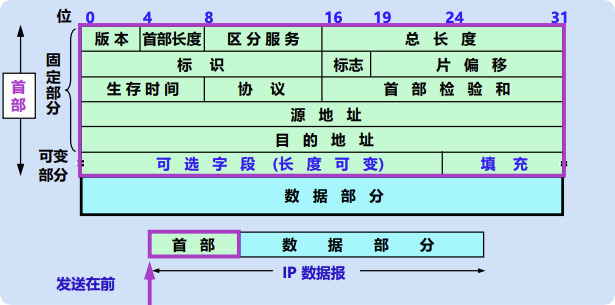

# 4.2.5 IP数据报的格式 ⭐ **重点：分片计算**

IP数据报由 **首部** 和 **数据** 两部分组成。首部前20字节是固定的。

## 交互式数据报解析器

下面是一个实际的 IP 数据报示例（来自 `ping 8.8.8.8` 的 ICMP 数据包）。点击字段可以查看每个字段的详细说明（包括英文全称、含义、作用和规则）：

<IPDatagramViewer />

## IP数据报分片计算 ⭐⭐⭐ **综合题核心考点**

**场景**：一个大数据报（总长度 > MTU）经过一个MTU较小的网络。

**计算步骤**：

1. **确定分片数量**：
   - 数据部分长度 = 总长度 - 首部长度（通常20字节）
   - 每个分片的数据部分最大长度 = MTU - 首部长度
   - 分片数量 = ⌈数据部分长度 / (MTU - 首部长度)⌉

2. **标识 (Identification)**：
   - 分片后**保持不变**，所有分片使用相同的标识值

3. **标志 (Flags)**：
   - **MF (More Fragment)**：
     - 只有**最后一个分片** MF=0（表示这是最后一个）
     - **其余所有分片** MF=1（表示后面还有分片）
   - **DF (Don't Fragment)**：DF=1 禁止分片

4. **片偏移 (Fragment Offset)** ⭐ **重点！**：
   - 计算公式：`片偏移值 = 该分片数据部分起始字节序号 / 8`
   - 第一个分片的片偏移 = 0
   - 第二个分片的片偏移 = 第一个分片的数据长度 / 8
   - 第三个分片的片偏移 = (第一个分片数据长度 + 第二个分片数据长度) / 8
   - 以此类推...

5. **数据长度要求**：
   - 除最后一个分片外，其他分片的数据长度必须是 **8的倍数**
   - 最后一个分片的数据长度可以不是8的倍数

**计算示例**：
- 原始数据报：总长度 4000 字节，首部 20 字节，数据部分 3980 字节
- MTU = 1500 字节
- 每个分片数据部分最大 = 1500 - 20 = 1480 字节
- 分片1：数据长度 1480 字节，片偏移 = 0/8 = 0，MF=1
- 分片2：数据长度 1480 字节，片偏移 = 1480/8 = 185，MF=1
- 分片3：数据长度 1020 字节，片偏移 = 2960/8 = 370，MF=0（最后一个）

