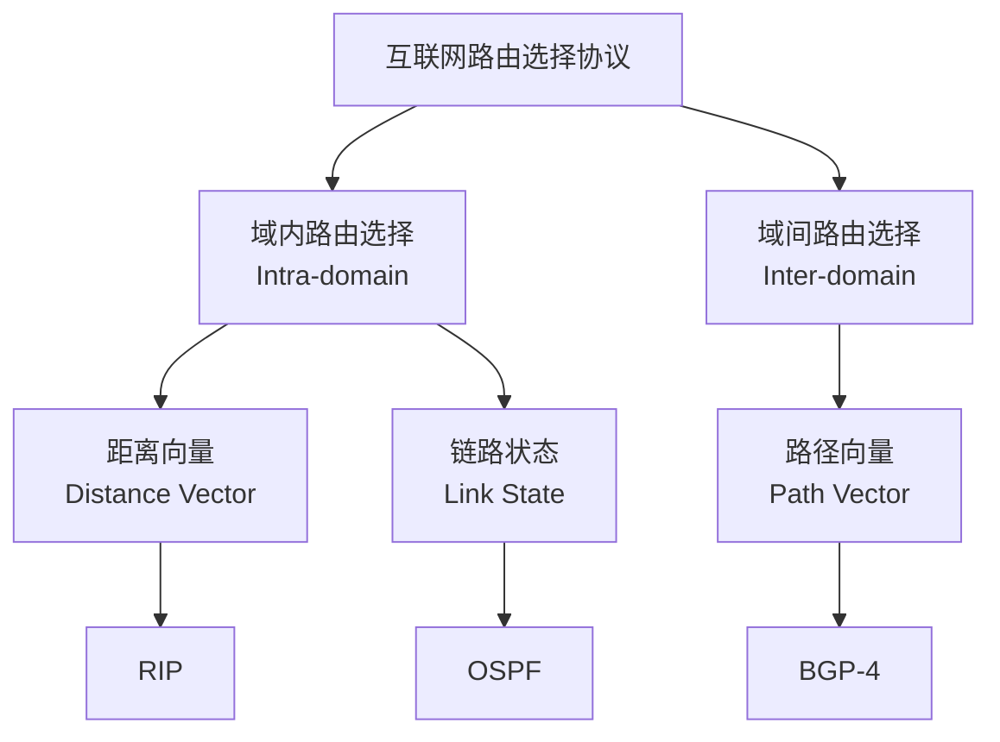

# 4.6 互联网的路由选择协议 (重点)

本节内容的考点主要是 **RIP、OSPF 和 BGP 的核心区别**（算法、度量、运作机制），常以选择题或简答题形式出现。

本章节包含以下内容：

- [4.6.1 基本概念](./4.6.1-基本概念/)
- [4.6.2 内部网关协议 RIP](./4.6.2-内部网关协议RIP/)
- [4.6.3 内部网关协议 OSPF](./4.6.3-内部网关协议OSPF/)
- [4.6.4 外部网关协议 BGP](./4.6.4-外部网关协议BGP/)

## 路由协议分类图

## 总结：三种协议对比表 ⭐⭐⭐ **必背考点**

| 特性 | RIP | OSPF | BGP |
| :--- | :--- | :--- | :--- |
| **类型** | 内部网关 (IGP) | 内部网关 (IGP) | 外部网关 (EGP) |
| **算法** | 距离向量 (Distance Vector) | 链路状态 (Link State) | 路径向量 (Path Vector) |
| **封装** | UDP (520) | IP (89) | TCP (179) |
| **度量 (Metric)** | 跳数 (最大15) | 带宽/延迟等 (代价) | 策略/属性 (AS-Path) |
| **交换对象** | 仅相邻路由器 | 全网 (洪泛) | 相邻的BGP发言者 |
| **交换内容** | 完整路由表 | 邻居链路状态 | 路径信息 |
| **核心问题** | 慢收敛 (坏消息传得慢) | 规模大时需划分区域 | 策略控制，消除环路 |

### ⚠️ 易错点提醒

1. **RIP的距离**：距离为16表示不可达。RIP交换的是**整个路由表**，而OSPF交换的是**链路状态**（只交换邻居信息）。

2. **传输层协议**：
   - RIP使用**UDP**（端口520）
   - OSPF直接使用**IP数据报**（协议字段值89），**不使用UDP或TCP**
   - BGP使用**TCP**（端口179）

3. **交换范围**：
   - RIP只和**相邻**路由器交换
   - OSPF向**全网**洪泛（所有路由器）
   - BGP在**相邻BGP发言者**之间交换

## 路由器的构成 (补充)

- **路由器结构**：
  - **路由选择部分 (控制层面)**: 运行RIP/OSPF/BGP协议，计算路由，生成**路由表**。
  - **分组转发部分 (数据层面)**:
    - **交换结构 (Switching Fabric)**: 核心部件，将输入端口的数据快速移送到输出端口（存储器、总线、纵横交换）。
    - **转发表**: 从路由表导出，优化用于快速查找。
- **输入/输出端口**：都有队列（缓存）。如果处理速率跟不上到达速率，会导致**分组丢失**（这是网络拥塞的征兆）。
